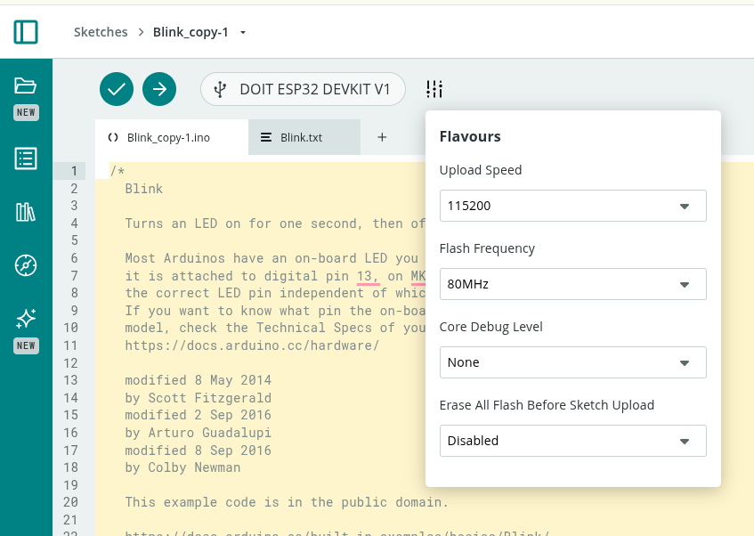
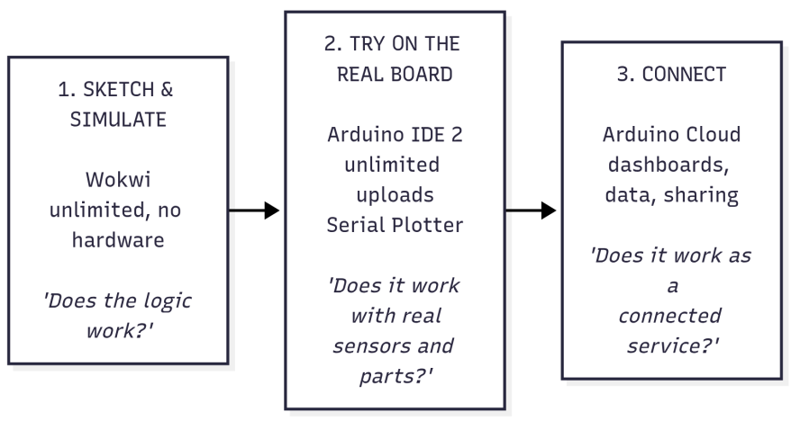

# IoT for Product Design

## 1. Purpose

This set of exercises introduces product design students to the Internet of Things (IoT) through hands-on work with ESP32 boards programmed in Arduino. It has two goals:

1. **From smart objects to ecosystems.** Show that sensors, actuators and connectivity let us build an *ecosystem of cooperating objects*, not just isolated smart objects. The value comes from the relationships between objects, people and services.
2. **From data to better products.** Show that the data IoT devices collect can improve the **design, development, use and maintenance** of a product or service, closing the loop between the designer and the product in the field.

The path goes step by step. Each exercise introduces **one or two new concepts** and reuses the skills from the previous ones. Every exercise ends with a short **design reflection**, because the aim is to train designers who understand what the technology makes possible, not to train embedded engineers.

To minimize the burden of installintools,  all the connected parts of the course (connectivity, dashboards, phone control, data storage, notifications, remote updates) are done on a **single platform: Arduino Cloud**. The class is made of designers with little experience of programming tools, so the priority is to keep the number of tools, accounts and concepts as low as possible. Three tools are used, each with a clear role:

| Tool | What it is for | Limits |
|---|---|---|
| **Wokwi** (browser simulator) | Sketching and trying behaviour, with no hardware and no risk | None that matter for the course |
| **Arduino IDE 2** (desktop app) | Free experimentation on the real board, Serial Plotter, unlimited uploads | Does not create dashboards |
| **Arduino Cloud** (browser + phone app) | The connected object: cloud variables, dashboards, phone control, data, sharing | Limited number of compilations per day on the Free plan |

Because Arduino Cloud limits the number of compilations per day, students learn early to **try things in Wokwi and the Arduino IDE, and to use the Cloud only for the "connected" version** of their work (§5.3).

To run Arduino Cloud 1) install the Arduino Cloud Agent https://cloud.arduino.cc/download-agent/, 2) Install pyserial `sudo apt update
sudo apt install python3-serial`

If necessary reduce the upload speed 

---

## 2. Running scenario: "The Connected Studio"

To keep the exercises coherent, they all share one scenario: a **shared studio / co-working room** that the class progressively "brings to life".

- Every group designs and builds **one object** for the studio, e.g. a desk lamp, a "focus" totem, a plant pot, a window/air-quality monitor, a doorbell/presence badge, a coffee corner counter, or a noise meter.
- In the first exercises each object works **alone** (smart object).
- Later the objects **talk to each other** through Arduino Cloud (ecosystem).
- Finally the objects are **used for real** for sometimes, and the data they produce is used to **redesign** them (data-driven design).

This scenario makes both goals concrete. Students experience first-hand what changes when their object is no longer alone, and when it starts "reporting back" how it is actually used.

---

## 3. Target audience and prerequisites

- Product design students (bachelor or master level) with **limited experience of digital tools for programming**.
- No prior programming experience is required. Variables, `if` and loops are introduced in Exercises 0–1, always starting from working examples that students modify rather than write from scratch.
- Groups of 2–3 students, one hardware kit per group.
- Each student needs a laptop with a Chromium-based browser or Firefox, the Arduino IDE 2, and the **Arduino Cloud Agent** (a small program that lets the browser upload code to the board). A smartphone with the **Arduino IoT Remote** app is useful from Exercise 5.

---

## 4. Hardware kit (per group)

| Component | Purpose | First used in |
|---|---|---|
| ESP32 DevKit (e.g. ESP32-WROOM-32 or ESP32-S3) | Microcontroller with Wi-Fi | Ex 0 |
| Breadboard, jumper wires, USB **data** cable | Prototyping | Ex 0 |
| LEDs + resistors, RGB LED ring (WS2812 / NeoPixel) | Visual output | Ex 0 / Ex 2 |
| Push buttons, potentiometer | Direct user input | Ex 1 |
| Light sensor (LDR or BH1750) | Environment sensing | Ex 1 |
| Temperature/humidity sensor (DHT22 or BME280) | Environment sensing | Ex 1 |
| PIR motion sensor | Presence detection | Ex 3 |
| Servo motor, buzzer | Physical actuation, sound | Ex 2 |
| Relay module (low voltage only) | Switching loads | Ex 7 (optional) |
| Accelerometer (MPU6050), optional | Handling / vibration / wear | Ex 13 |
| LiPo battery + charger (optional) | Autonomy, battery monitoring | Ex 13 |

All components above are available in **Wokwi**, so every circuit can be drawn and tested in the simulator before it is wired.

---

## 5. Software and cloud stack

### 5.1 One platform: Arduino Cloud

| Need | Arduino Cloud feature | Replaces (in the previous edition) |
|---|---|---|
| Registering the board | **Device** (ESP32 added as a "third-party device", with a Device ID and a Secret Key) | Broker credentials |
| Describing what the object senses and does | **Thing** with **cloud variables** (name, type, permission, update policy) | Topics and JSON payloads |
| Writing and uploading code | **Cloud Editor** (web), with a sketch generated automatically from the Thing | Arduino IDE + MQTT libraries |
| Seeing and controlling the object | **Dashboards** and widgets (value, gauge, chart, switch, slider, colour, status, map, image, scheduler…) | ThingsBoard dashboards, MQTT Explorer |
| Phone as a remote | **Arduino IoT Remote** app (iOS/Android), with phone-specific dashboard layouts | MQTT Panel apps |
| Objects talking to objects | **Variable synchronisation** between Things | Shared MQTT topics |
| Places and groups of objects | **Tags** on Things and devices, shared **studio dashboards** | ThingsBoard assets and relations |
| History and data export | Chart widgets with time windows, **download of historical data as CSV** | ThingsBoard historical dashboards, InfluxDB |
| Alerts | **Triggers** (conditions on variables or on device connection → e-mail / push notification) | ThingsBoard alarm rules |
| External services | **Webhooks** (to Zapier, IFTTT, Make, Google Sheets…) and "service Things" prepared by the instructor | Node-RED |
| Remote configuration | Read & Write cloud variables used as settings (their last value is kept by the cloud and restored when the object reconnects) | Retained config topics / shared attributes |
| Updating the product in the field | **Over-the-air (OTA) upload** from the Cloud Editor | ArduinoOTA / HTTP OTA |
| Working as a class | A **shared space** (Arduino Cloud for Schools / organisation), where all Things and dashboards of the class live together | One broker account per group |

Under the hood Arduino Cloud uses the same ideas seen in any IoT platform (a message broker, publish/subscribe, TLS encryption), but it hides them behind a simple mental model:

> **A cloud variable is a variable that exists in two places at the same time — on the board and in the cloud — and Arduino Cloud keeps the two copies in sync.**

This model is enough for the whole course. The underlying protocol (MQTT) is mentioned in Exercise 4 and in the reflections, but students never have to program it directly.

**Plan-dependent features.** Some features depend on the Arduino Cloud plan (e.g. number of Things, data retention, number of daily compilations, OTA, triggers, sharing, shared spaces). In this document they are marked with **(plan)**. Check the current plan limits before the course starts (§10).

### 5.2 Shared conventions: the "variable contract"

An ecosystem only works if objects "speak the same language". In Arduino Cloud, objects talk through **synchronised cloud variables**, and two variables can be synchronised only if they have the **same type**. From Exercise 7 onward the class therefore uses a shared **variable contract**, defined by the instructor together with the students:

| Name | Type | Permission | Meaning | Who writes it |
|---|---|---|---|---|
| `studioScene` | `int` (0 = normal, 1 = focus, 2 = presentation, 3 = closed) | Read & Write | Current scene of the studio | Scene dashboard, hub |
| `someoneAtDoor` | `bool` | Read only | A person has just arrived | Door badge |
| `roomOccupied` | `bool` | Read only | Someone is in the room | Presence objects |
| `co2` | `int` (ppm) | Read only | Air quality | Air monitor |
| `noiseLevel` | `int` (0–100) | Read only | Loudness | Noise meter |
| `<object>Heartbeat` | `int` (counter) | Read only | "I am alive" signal, increases every minute | Every object |
| `<object>Mode` | `String` | Read & Write | Current mode of each object | Object, dashboard |

Each group also documents, for its own object, a **product sheet of its variables**: name, type, unit, range, permission, update policy, and what it means for the user.

Naming rules: `camelCase`, English, units written in the documentation (not in the name), no spaces or accents.

Designing this contract is itself a design activity: it is the object's **"interface" towards other objects**, just as its form and controls are its interface towards people.

### 5.3 The "compilation budget": where to do what

On the Free plan, every compilation in the Cloud Editor (including each upload and each OTA update) uses up part of a **daily allowance**. This is not only a constraint: it is an opportunity to teach a good prototyping habit — **think and try cheaply first, commit to the real thing later.**

The rule of thumb given to students:



Practical tips:

- **Simulate the dashboard in Wokwi.** A potentiometer or a button in the simulator can stand in for a dashboard slider or switch; the Serial Monitor can stand in for a value widget. The behaviour can be refined without any Cloud compilation.
- **Keep the behaviour in functions.** The same functions (e.g. `updateLamp()`, `readSensors()`) are copied from the Wokwi/IDE sketch into the Cloud sketch unchanged; only the "glue" with cloud variables is new.
- **Use the "Verify" button sparingly** in the Cloud Editor: fix errors in the IDE first.
- **Cloud sketches can also be compiled in the Arduino IDE 2.** Once students are confident (from Exercise 6), they can open their Cloud sketch in the desktop IDE (via the IDE's *Remote Sketchbook*, or by downloading it) with the `ArduinoIoTCloud` library installed, and upload it with no daily limit. The object still connects to Arduino Cloud, because the Device ID and Secret Key are part of the sketch. After adding or changing variables in the Thing, the sketch must be pulled again, because the Cloud regenerates the `thingProperties.h` file.
- The table in §6 shows, for every exercise, which tools are used.

---

## 6. Overview of the path

The exercises are grouped in four phases. The first two phases build the skills; phases C and D address the two main goals directly.

| Phase | Exercises | Key question | Goal addressed |
|---|---|---|---|
| **A — The smart object** | 0 – 3 | What can an object sense, decide and do on its own? | Baseline |
| **B — The connected object** | 4 – 6 | What changes when an object is on the network? | Enabler for 1 & 2 |
| **C — The ecosystem** | 7 – 10 | What emerges when objects cooperate? | **Goal 1** |
| **D — Data-driven design** | 11 – 14 | How can data from the field improve the product/service? | **Goal 2** |
| **Final project** | 15 | Design a connected product-service and iterate on it with data | 1 + 2 |

### Concept progression

W = Wokwi, IDE = Arduino IDE 2, AC = Arduino Cloud. **Bold** = main tool of the exercise.

| # | Exercise | New concepts | Tools | Builds on |
|---|---|---|---|---|
| 0 | Hello ESP32 — three workspaces | Wokwi, IDE, upload, `setup()`/`loop()`, digital output; Arduino account | **W**, **IDE** | — |
| 1 | Sensing the world | Digital/analog input, sensors, Serial Monitor/Plotter, sampling | W, **IDE** | 0 |
| 2 | Acting on the world | Actuators (PWM, servo, NeoPixel, buzzer), mapping values | W, **IDE** | 0, 1 |
| 3 | The isolated smart object | Sense→decide→act loop, state machines, non-blocking timing, interaction design | **W**, IDE | 1, 2 |
| 4 | Going online | Device, Thing, cloud variables, auto-generated sketch, first dashboard | W, **AC** | 3 |
| 5 | Remote control | Read & Write variables, `onChange` callbacks, phone as a remote (IoT Remote) | W, **AC** | 4 |
| 6 | The object as a service | Update policies, variable types, connection events, security, dashboard design, sharing; compiling Cloud sketches in the IDE | **AC**, IDE | 4, 5 |
| 7 | Objects talking to objects | **Variable synchronisation**, shared contract, loose coupling | **AC** | 5, 6 |
| 8 | Who is there? | Device status, heartbeats, connection callbacks, graceful degradation, **studio map dashboard** | W, **AC** | 6, 7 |
| 9 | The orchestrator | Scenes, hub Thing, scheduler, triggers, webhooks, service Things | **AC** | 7, 8 |
| 10 | Ecosystem design sprint | System mapping, emergent behaviour, conflicts, **tags** and studio dashboard | **AC** | 7 – 9 |
| 11 | Remembering | Historical data, telemetry vs. events, instrumentation plan, CSV export | **AC** | 6, 9 |
| 12 | How is it really used? | Usage analytics in a spreadsheet, field study, design insights from data | **AC**, spreadsheet | 11 |
| 13 | Keeping it alive | Device health, wear counters, predictive maintenance, **triggers as alarms** | IDE, **AC** | 11, 12 |
| 14 | Closing the loop | Settings variables, **OTA updates**, A/B testing | **AC** | 12, 13 |
| 15 | Final project | Integration of everything | all | all |

---

## 7. Detailed exercises

Each exercise uses the same format: **Goal · New concepts · Tools · Material · Activities · Deliverable · Design reflection · Indicative time**.

---

### Phase A — The smart object

In Phase A the object works alone, so **Arduino Cloud is not used yet**. Students become comfortable with code in the two unlimited environments, Wokwi and the Arduino IDE.

#### Exercise 0 — Hello ESP32: three workspaces

- **Goal:** Get familiar with the tools and with the idea that "behaviour is code".
- **New concepts:** A simulator versus a real board, the Arduino IDE 2, the ESP32 board package, selecting board and port, uploading, `setup()` and `loop()`, digital output, `delay()`. Creating an Arduino account (used from Exercise 4).
- **Tools:** Wokwi, Arduino IDE 2.
- **Material:** ESP32, LED, resistor.
- **Activities:**
  1. **Wokwi:** open the ESP32 *Blink* project provided by the instructor, press *Play*, then change the numbers in `delay()` and see what happens. Add a second LED to the circuit.
  2. **Arduino IDE 2:** install the IDE and the ESP32 core (the instructor provides a step-by-step sheet with screenshots). Select the board and the port, and upload the same *Blink* sketch to the real ESP32.
  3. Change the rhythm of the blink to express a "mood" (calm, alarm, heartbeat). Try it first in Wokwi, then on the board.
  4. Create an Arduino account and install the Arduino Cloud Agent, so that everything is ready for Exercise 4.
- **Deliverable:** A short video of the LED expressing three different moods, and the link to the Wokwi project.
- **Design reflection:** Even a single LED can communicate. Which blinking patterns are unambiguous for a user? What was different between the simulated LED and the real one?
- **Time:** 2 h.

#### Exercise 1 — Sensing the world

- **Goal:** Read the physical world and understand what a sensor actually measures.
- **New concepts:** Digital input (button, pull-up), analog input (ADC, potentiometer, LDR), digital sensors (DHT22/BME280) through libraries, installing a library, Serial Monitor and **Serial Plotter**, sampling rate, noise.
- **Tools:** Wokwi to prepare the circuit, Arduino IDE 2 to measure the real world.
- **Material:** Button, potentiometer, LDR, DHT22/BME280.
- **Activities:**
  1. In Wokwi, wire the button and the sensors and print their values. Wokwi lets you "move" the simulated sensors with a slider.
  2. On the real board (IDE), read a button and print its state; notice bouncing, which does not happen in the simulator.
  3. Read the LDR and plot it with the Serial Plotter while covering it with a hand.
  4. Read temperature and humidity; breathe on the sensor and watch the response time.
- **Deliverable:** Screenshot of the Serial Plotter with annotated "events" (hand, breath, lamp on…).
- **Design reflection:** Sensors are imperfect. They are noisy, slow and limited in range, and a simulator hides most of these imperfections. How does this affect what a product can "know" about its user and environment?
- **Time:** 2 h.

#### Exercise 2 — Acting on the world

- **Goal:** Let the object produce physical, perceivable effects.
- **New concepts:** PWM (LED dimming), servo motors, NeoPixel colour, buzzer tones, `map()` to translate input ranges into output ranges.
- **Tools:** Wokwi, Arduino IDE 2.
- **Material:** LED, NeoPixel ring, servo, buzzer, potentiometer.
- **Activities:**
  1. Dim an LED with the potentiometer.
  2. Move a servo in proportion to the light level (a "sunflower").
  3. Map temperature to a colour on the NeoPixel ring (blue → red).
  4. Explore freely: the IDE has no upload limit, so try many variations of speed, colour and sound.
- **Deliverable:** A short demo of a sensor that directly drives an actuator.
- **Design reflection:** Direct mapping (sensor → actuator) is simple but "dumb". When does the object need to *decide* instead of just react?
- **Time:** 2 h.

#### Exercise 3 — The isolated smart object

- **Goal:** Build the first version of the group's studio object as a **stand-alone smart object**.
- **New concepts:** The sense → decide → act loop, finite-state machines (e.g. `IDLE`, `ACTIVE`, `ALERT`), non-blocking timing with `millis()`, hysteresis, basic interaction design (feedback, affordances). Organising code in functions (`readSensors()`, `decide()`, `updateOutputs()`).
- **Tools:** Wokwi to design the behaviour, Arduino IDE 2 to build the prototype.
- **Material:** Any combination of the previous components plus the PIR sensor.
- **Activities:**
  1. Each group picks its studio object (lamp, focus totem, plant pot, air monitor, etc.).
  2. Draw the state diagram on paper first, then implement it in Wokwi.
  3. Move the sketch to the real board with the IDE and tune the thresholds with real sensors.
  4. Example: a *focus lamp* that turns on when someone sits (PIR), adapts brightness to ambient light, and turns red when a button signals "do not disturb".
- **Why `millis()` matters here:** from Exercise 4 the object must call `ArduinoCloud.update()` continuously to stay connected. Long `delay()`s would "freeze" the connection, so non-blocking timing is learned now, when it is still simple.
- **Deliverable:** A working prototype, its state diagram, the Wokwi link, and a one-page "product card" (user, purpose, behaviour).
- **Design reflection (key moment):** List everything your object **cannot** do because it is alone. It cannot know whether the room is empty, cannot be controlled from far away, cannot tell anyone it is broken, and you do not know how people use it. This list motivates the rest of the course.
- **Time:** 4 h.

---

### Phase B — The connected object

From Phase B the object lives on Arduino Cloud. Before each Cloud session, students prepare their changes in Wokwi or the IDE (§5.3).

#### Exercise 4 — Going online

- **Goal:** Put the object on the network and let it "speak" to the cloud.
- **New concepts:** **Device** (the physical board), **Thing** (the digital description of the object), **cloud variables** (name, type, *Read only* permission), network credentials, the sketch that Arduino Cloud writes automatically (`thingProperties.h`, `ArduinoCloud.update()`), first **dashboard**. The idea behind the scenes: the cloud acts as a "post office" (a broker) that receives and delivers messages (publish/subscribe, MQTT).
- **Tools:** Arduino Cloud (Cloud Editor, dashboards). Wokwi to prepare the code.
- **Activities:**
  1. In Arduino Cloud, add the ESP32 as a **device** (third-party device). Save the Device ID and Secret Key in a safe place.
  2. Create a **Thing** for the group's object, associate the device, and enter the Wi-Fi credentials.
  3. Add the object's sensors as **Read only** variables (e.g. `temperature`, `light`, `presence`).
  4. Open the automatically generated sketch. Paste in the functions from Exercise 3 and assign sensor readings to the cloud variables. **One** compilation and upload.
  5. Build a first dashboard with value and gauge widgets. Then look at the dashboards of other groups on the projector: the whole class is now online.
- **Code skeleton** (the parts marked "generated" are written by Arduino Cloud):
  ```cpp
  #include "thingProperties.h"    // generated: cloud variables and connection

  unsigned long lastRead = 0;

  void setup() {
    Serial.begin(9600);
    initProperties();                                    // generated
    ArduinoCloud.begin(ArduinoIoTPreferredConnection);   // generated
    setupSensors();              // your code from Exercise 3
  }

  void loop() {
    ArduinoCloud.update();       // keeps the two copies of the variables in sync
    if (millis() - lastRead > 10000) {   // every 10 s, without delay()
      lastRead = millis();
      temperature = readTemperature();   // assigning = "sending to the cloud"
      light = readLight();
    }
    updateOutputs();             // your behaviour from Exercise 3
  }
  ```
- **Deliverable:** A screenshot of the Thing (variables) and of the first dashboard with live data.
- **Design reflection:** Your data is now visible to others. What does that imply for privacy? What should an object send to the cloud, and what should it keep to itself?
- **Time:** 3 h.

#### Exercise 5 — Remote control

- **Goal:** Let the network change the object's behaviour.
- **New concepts:** **Read & Write** variables, `onXxxChange()` callback functions (the code that runs when the variable is changed from the dashboard), control widgets (switch, push button, slider, colour/coloured light, value selector), the **Arduino IoT Remote** app on the phone, keeping physical and digital controls consistent.
- **Tools:** Arduino Cloud, IoT Remote app. Wokwi to test the callbacks, using a button or potentiometer in place of the widget.
- **Activities:**
  1. Add Read & Write variables such as `mode` (String or int), `lampColor` (Coloured Light) and `brightness` (int), and implement their callbacks.
  2. Build a control panel on the dashboard and check its phone layout in the IoT Remote app.
  3. Keep the physical controls working. When the user presses the object's own button, the code must also update the cloud variable, so that the dashboard always shows the truth.
- **Code example:**
  ```cpp
  // generated empty by Arduino Cloud, filled in by the students
  void onBrightnessChange() {
    setLampBrightness(brightness);   // the dashboard changed the value
  }

  void onButtonPressed() {           // physical control
    mode = "focus";                  // the dashboard will show "focus" too
    applyMode(mode);
  }
  ```
- **Deliverable:** A video that controls the object from the phone and from its button, with the dashboard staying consistent.
- **Design reflection:** The object now has two interfaces, one physical and one digital. How do you keep them consistent? Who "wins" in a conflict?
- **Time:** 3 h.

#### Exercise 6 — The object as a service

- **Goal:** Turn the object into a small **service** with a designed dashboard, and make it robust and secure.
- **New concepts:**
  - **Update policies:** *on change* (with a threshold) versus *periodically* — how often the object talks, and why it matters for energy, data and clarity.
  - **Specialised variable types** (e.g. temperature, percentage, coloured light, location, schedule) that carry meaning and units.
  - **Connection events** (`ArduinoCloud.addCallback(...CONNECT / DISCONNECT / SYNC...)`): what the object shows to the user while it is connecting or offline.
  - **Security:** the Secret Key and Wi-Fi password live in the *Secret* tab and must never be shared (screenshots, public sketches); who has access to a dashboard can control the object.
  - **Dashboard design** for a specific user; **sharing** dashboards (plan).
  - Opening the Cloud sketch in the **Arduino IDE 2** to compile without the daily limit (§5.3).
- **Tools:** Arduino Cloud, Arduino IDE 2.
- **Activities:**
  1. Set a sensible update policy for each variable and justify it (e.g. temperature on change with a 0.5 °C threshold; light every 60 s).
  2. Show the connection status on the object itself (e.g. a slow blue blink while connecting).
  3. Open the Thing's sketch in the Arduino IDE 2, compile and upload it from there, and check that the dashboard still works.
  4. Redesign the dashboard for a specific user. Which information is shown first, and which is hidden? Use layout, widget choice, labels and the phone layout on purpose. Make separate desktop and phone versions if they serve different moments of use.
  5. Share the dashboard with the instructor and with another group.
- **Deliverable:** The shared dashboard (desktop and phone screenshots), the product sheet of the variables (§5.2), and a short description of the "service" the object now offers.
- **Design reflection:** The product is now a *physical object plus a digital service*. Which part is the product? Sketch the service blueprint. Is the dashboard designed for the end user, the owner of the space, or the maintainer?
- **Time:** 4 h.

---

### Phase C — The ecosystem (Goal 1)

Phase C needs all the class's Things to be able to see each other. This is done in a **shared space** of Arduino Cloud (plan). See §10 for alternatives.

#### Exercise 7 — Objects talking to objects

- **Goal:** Make objects from **different groups** cooperate directly, without any central logic.
- **New concepts:** **Variable synchronisation** (a variable of one Thing is linked to a variable of another Thing, so that when one changes, the other changes too), the shared variable contract (§5.2), loose coupling (the object that produces a value does not need to know who uses it), events versus commands.
- **Tools:** Arduino Cloud.
- **Activities:**
  1. Groups pair up. Object A reacts to a variable of object B. Examples:
     - The door presence badge sets `someoneAtDoor`, and the desk lamp greets the person.
     - The air monitor's `co2` goes above a threshold, and the focus totem suggests a break with a colour.
     - The plant pot's `thirsty` becomes true, and the coffee corner counter shows a reminder.
  2. In each Thing, add the variable to listen to (with the **same type** as in the contract) and link it with *Sync with other Things*. Write the callback that reacts to it.
  3. Then swap partners. If the contract is respected, the objects must work with *new* partners without changing the code of the other group — often by only changing the synchronisation, without any new compilation.
- **Deliverable:** A demo of two or more objects cooperating, plus a diagram of which variables each object produces and uses.
- **Design reflection:** What made it easy or hard to connect to someone else's object? The contract is a design artefact, just like a physical connector standard.
- **Time:** 3 h.

#### Exercise 8 — Who is there? Presence and resilience

- **Goal:** Make the ecosystem aware of which objects are alive and able to cope when some are missing.
- **New concepts:** Device status (online/offline) in Arduino Cloud, **heartbeats** (a counter that increases every minute: if it stops, the object is gone), connection callbacks, a "capabilities" description of each object, **graceful degradation**.
- **Tools:** Arduino Cloud; Wokwi to test the fallback logic (a switch in the simulator plays the role of "partner offline").
- **Activities:**
  1. Each object publishes a `<object>Heartbeat` counter and a `<object>Capabilities` String (e.g. `"sensors: temp, lux; actuators: rgb"`), both part of the contract.
  2. Objects that depend on a partner watch its heartbeat, synchronised as in Exercise 7. If it does not change for 3 minutes, they switch to a fallback, e.g. the lamp goes back to its local PIR when the door badge is offline.
  3. Unplug objects at random. The others must notice and adapt, and the user must be able to tell (e.g. a small "alone" colour).
  4. As a class, build a **"studio map" dashboard**: an image widget with the floor plan of the room, and next to it one status/LED widget per object, arranged like the objects in the room and labelled with their position. Each widget shows whether the object is alive. Add links (or notes) to each group's own dashboard.
- **Deliverable:** The studio map dashboard showing all objects and their capabilities, plus a video of the ecosystem reacting to objects that are unplugged.
- **Design reflection:** In an ecosystem, failures are normal. How should each object behave when its partners disappear? Can the user tell what is going on?
- **Time:** 3 h.

#### Exercise 9 — The orchestrator: scenes, rules and external services

- **Goal:** Add a "brain" that coordinates many objects and brings in information from outside the room.
- **New concepts:**
  - **Scenes:** one intent controls many objects. A single `studioScene` variable, synchronised with every object, and each object decides how to interpret it.
  - A **hub Thing:** an ESP32 (prepared by the instructor or by a volunteer group) that receives the variables of all objects and implements rules that combine several sources (context).
  - **Scheduler** widgets and schedule variables for time-based behaviour (e.g. "closed" scene every evening at 20:00).
  - **Triggers** (plan): e-mail or push notifications when a condition occurs.
  - **Webhooks** (plan) to external services (Zapier, IFTTT, Make, Google Sheets, Telegram), and **service Things** prepared by the instructor that bring external data into the Cloud (e.g. a *Weather* Thing with `rainExpected` and `outsideTemp`).
  - Trade-offs between logic in the objects (edge) and logic in the cloud/hub.
- **Tools:** Arduino Cloud.
- **Activities:**
  1. Build a **scene dashboard** with a value selector for `studioScene` (Normal, Focus, Presentation, Closed). Implement at least one scene in every object, e.g. *"Presentation"*: lamps dim, focus totems turn blue, the noise meter alerts on loud sounds.
  2. Implement one **context rule** in the hub that uses more than one object, e.g. "if nobody is present for 30 min and the window monitor says the window is open → set `windowAlert`", with a trigger that sends a notification to the phone.
  3. Add a schedule that changes the scene automatically at given times.
  4. Bring in an external service: sync with the *Weather* Thing, so the lamp at the entrance turns blue when rain is expected ("take an umbrella").
  5. *(Optional)* Use the IoT Remote app's "phone as a device" function: the phone becomes a Thing that shares, for example, its position or light sensor with the ecosystem.
- **Deliverable:** A demo of a scene and a rule, plus a diagram showing where each rule lives (object, hub, trigger, schedule).
- **Design reflection:** Which logic should live in the object (fast, works offline, private) and which in the cloud or in the hub (global view, easy to change)? What happens to the user experience if the internet goes down?
- **Time:** 4 h.

#### Exercise 10 — Ecosystem design sprint

- **Goal:** Consolidate Goal 1 by designing the studio as a **system** rather than a collection of objects.
- **New concepts:** System maps, emergent behaviour, conflicts between objects (two rules that want opposite things), priorities and user override, ecosystem value versus object value. **Tags** in Arduino Cloud (e.g. `area: desk`, `area: coffee corner`, `role: sensor`) as a simple digital model of places and roles.
- **Tools:** Arduino Cloud, paper and post-its.
- **Activities:**
  1. As a whole class, map all the objects, variables, rules and people in the studio.
  2. Turn the map into a model in Arduino Cloud: add **tags** to every Thing and device (area, role, owner group), and use them to filter the list of Things. Organise the studio dashboard by area.
  3. Find at least one **emergent** feature, a service that no single object can provide (e.g. an "occupancy and comfort" index of the room built from every object's data).
  4. Find and solve at least one **conflict** (e.g. the energy-saving rule turns the lamp off while someone is reading in a corner the PIR cannot see). Decide the priorities: what can the user always override?
  5. Implement the emergent feature in the hub Thing, save it as a variable (e.g. `comfortIndex`), and show it on a **studio-level dashboard**.
- **Deliverable:** A system map poster, the tagged Things in Arduino Cloud, and a studio dashboard showing the emergent feature live.
- **Design reflection:** Compare the list of limitations from Exercise 3 with what the ecosystem now does. What has the ecosystem added, and what new problems (complexity, privacy, dependency on one company's platform) has it introduced?
- **Time:** 4 h (workshop).

---

### Phase D — Data-driven design (Goal 2)

Phase D needs data to be kept for the whole field study. Check the **data retention** of the plan (plan) before starting; if it is shorter than the deployment, download the data every day (Exercise 11).

#### Exercise 11 — Remembering: storing and visualising data

- **Goal:** Move from live data to **historical data**, the raw material for design insights.
- **New concepts:** Arduino Cloud stores every change of a variable with its time, so a variable is also a **time series**. The difference between **telemetry** (periodic measurements, e.g. `temperature`) and **events** (user actions, state changes). Representing events in Arduino Cloud: an event variable (e.g. `lastEvent` as a String such as `"long_press:focus"`) and **event counters** (e.g. `dimmerUses`, increased at each use). An **instrumentation plan** (deciding in advance what to record and why). Chart widgets and time windows. **Downloading historical data** as CSV.
- **Tools:** Arduino Cloud, a spreadsheet (Google Sheets, Excel, Numbers).
- **Activities:**
  1. Write an instrumentation plan: for each design question you have about your object ("Do people use the dimmer?", "How long do they stay?"), define which variable or event answers it and its update policy.
  2. Add the event and counter variables to the Thing, and update them in the code. Prepare and test the changes in Wokwi first; then compile once in the Cloud (or in the IDE).
  3. Build a **"usage" dashboard**, separate from the live dashboard of Exercise 6, with charts over days and the counters. Give each widget the question it answers as its title.
  4. Download the historical data as CSV and open it in a spreadsheet. Make a first pivot table (e.g. events per hour of the day).
- **Deliverable:** The instrumentation plan, the usage dashboard with at least 24 h of data, and a first spreadsheet chart.
- **Design reflection:** Data only answers the questions you prepared for. What would you *like* to know that your object cannot measure? Which data should you **not** collect (data minimisation, GDPR)? Where is the data stored, and who can see it?
- **Time:** 4 h.

#### Exercise 12 — How is it really used? (use and design)

- **Goal:** Use field data to understand real use and to derive **design insights**.
- **New concepts:** Field deployment ("in the wild"), usage analytics (frequency, duration, time of day, feature adoption, error paths), combining quantitative data with qualitative observations (short interviews, diaries), and the difference between intended and actual use.
- **Tools:** Arduino Cloud (dashboards, CSV download), spreadsheet.
- **Activities:**
  1. Deploy the objects in a real space (the studio, the department, the students' homes) for **at least one week**. Objects taken home need a 2.4 GHz Wi-Fi network: the Wi-Fi credentials in the Thing can be changed without touching the code, but a new upload is needed.
  2. Download the data (daily, if retention is short) and analyse it in the spreadsheet. Look for:
     - features that are never used, or that are used differently than expected;
     - "struggle" patterns (e.g. repeated button presses, commands overridden right away);
     - wrong defaults (e.g. people always change the brightness right after power-on).
  3. Run 2–3 short interviews with users to explain what the data shows.
- **Deliverable:** A "data-driven design review": 3 insights, each supported by a chart (dashboard or spreadsheet) and a user quote, and each followed by a redesign proposal.
- **Design reflection:** Where did the data surprise you? Where would the data alone have misled you without talking to the users?
- **Time:** 1 week of deployment + 3 h of analysis.

#### Exercise 13 — Keeping it alive (maintenance)

- **Goal:** Use data to **monitor and maintain** the product in the field.
- **New concepts:** Device health variables (uptime, reboot reason, Wi-Fi signal strength RSSI, free memory, battery voltage), wear counters (servo cycles, relay switches, LED on-hours), sensor drift and plausibility checks ("stuck" values), threshold and trend-based alerts, basic **predictive maintenance**. **Triggers as alarms** (plan): conditions on health variables or on device disconnection, with e-mail or push notifications, and severity levels designed by the students.
- **Tools:** Arduino IDE 2 to develop and test the health code on the board (Serial Monitor), then Arduino Cloud.
- **Activities:**
  1. Add a small set of health variables, updated every few minutes. Wear counters are **Read & Write** variables: the cloud keeps their last value, so they survive a reboot of the object (alternatively, store them in the board's flash memory with `Preferences`).
  2. Define alarms with a severity, for example:
     - *critical:* object disconnected for more than 10 min (device status trigger);
     - *major:* battery below a threshold;
     - *minor:* RSSI too weak;
     - *warning:* sensor stuck at a constant value, or servo cycles close to the expected lifetime.

     Implement the simple ones as triggers, and the complex ones on the object itself, which then sets an `alarmLevel` variable (0–3) that can itself fire a trigger.
  3. Build a **"fleet health" dashboard** for the maintainer: the studio map from Exercise 8 with each object's `alarmLevel`, RSSI and battery widgets, and charts of the wear counters.
  4. Optional: use the accelerometer to detect drops or vibration, or estimate when a battery will run out from its discharge trend.
- **Deliverable:** The fleet health dashboard for all the class's objects, plus at least one alarm that actually fired during the deployment, with an explanation of its cause and how it was handled.
- **Design reflection:** How would the maintenance data change the *physical* design of the next version (battery size, antenna position, component choice, access for repairs)? How does it change the service (support, warranty, replacement)?
- **Time:** 3 h.

#### Exercise 14 — Closing the loop (development)

- **Goal:** Improve the product **after it has been deployed**, and test the changes with data.
- **New concepts:** **Settings variables** (Read & Write variables that hold parameters such as timeouts, thresholds and colours; the cloud keeps them and sends them back to the object when it reconnects), **A/B testing**, versioning (a `firmwareVersion` String variable), **OTA updates** from the Cloud Editor (plan), and the ethics of changing a product after the user has bought it.
- **Tools:** Arduino Cloud.
- **Activities:**
  1. Make the key behaviour parameters configurable remotely instead of hard-coding them (e.g. `autoOffMinutes`, `lightThreshold`, `alertColor`).
  2. Build a **settings dashboard** with sliders and selectors, so that non-programmers (e.g. the owner of the space) can also change the parameters. Changing a setting needs **no compilation at all**.
  3. Choose one insight from Exercise 12 and create two variants (A and B), e.g. two auto-off timeouts or two feedback styles.
  4. Assign half of the objects to A and half to B (an `abGroup` variable), run the test for a few days, and compare the metrics side by side on an **A/B dashboard**, then in the spreadsheet.
  5. Push a firmware update **over the air** that includes the winning variant, and show the `firmwareVersion` of each object on the fleet health dashboard. Plan the OTA updates carefully: each one uses a compilation.
- **Deliverable:** A short A/B test report (hypothesis, metric, result, decision) with the A/B dashboard, and a working OTA update.
- **Design reflection:** The product is no longer "finished" when it leaves the factory. What does this mean for the design process, for the business model, and for the user's trust? What changes when the settings can be modified by someone who is not in the room?
- **Time:** 4 h + a few days of testing.

---

### Final project

The final project changes every year, depending on the selected design theme. The following is an example for the sake of illustration.

#### Exercise 15 — A connected product-service, designed and improved with data

- **Goal:** Integrate both goals in an original project.
- **Brief:** Each group, or a team of groups, designs a **product-service ecosystem** in a domain of its choice (home, health and well-being, retail, mobility, workplace, museum, agriculture…) that:
  1. includes **at least three cooperating objects** (at least two physical ESP32 objects, plus the hub, a service Thing, the phone or an external service) that follow a documented variable contract;
  2. provides at least one **emergent feature** that no single object could provide;
  3. has an **instrumentation plan** covering use and maintenance;
  4. is deployed for a short field test and goes through **at least one data-driven iteration** (a settings change or an OTA update) that is justified by the data.
- **Deliverables:**
  - working prototypes and a live demo;
  - Wokwi versions of the objects' behaviour (for documentation and for testing);
  - a system map and the variable contract;
  - Arduino Cloud dashboards: a live/control dashboard for the end user (desktop and phone), a usage dashboard for the designer, and a health dashboard with alarms for the maintainer. Each dashboard is designed for its audience;
  - a design report of max 10 pages: concept, ecosystem, data plan, insights, iteration, ethics/privacy considerations;
  - a 3-minute video.
- **Time:** 3–4 weeks.

---

## 8. Cross-cutting themes

These themes should come back throughout the path, especially in the design reflections:

- **Privacy and ethics:** data minimisation, consent, transparency to users (e.g. an LED that shows when data is being sent), GDPR, who owns the data, where the servers are.
- **Security:** Secret Keys and Wi-Fi passwords, who has access to a dashboard or to a shared space, what happens if someone else changes a Read & Write variable of your object.
- **Sustainability:** energy consumption (update policies, deep sleep), product lifespan, and repairability supported by maintenance data.
- **Platforms and dependency:** doing everything on one platform is simple, but the product now depends on a company's service, its plans and prices. What happens to the objects if the service changes or closes? What is the "exit plan"?
- **Interoperability:** the class variable contract, and a mention of real-world standards (Matter, Home Assistant, oneM2M) as the "grown-up" version of it.
- **Edge vs. cloud:** what must keep working without the internet.
