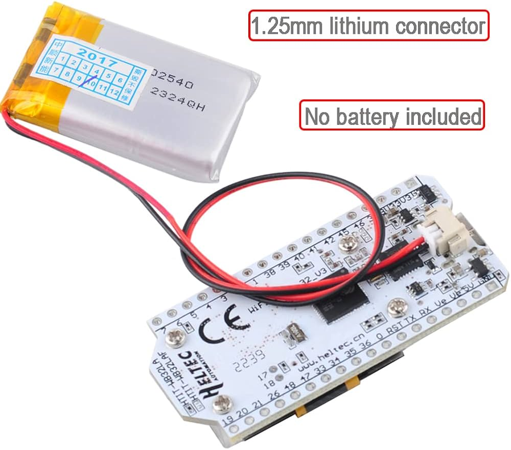
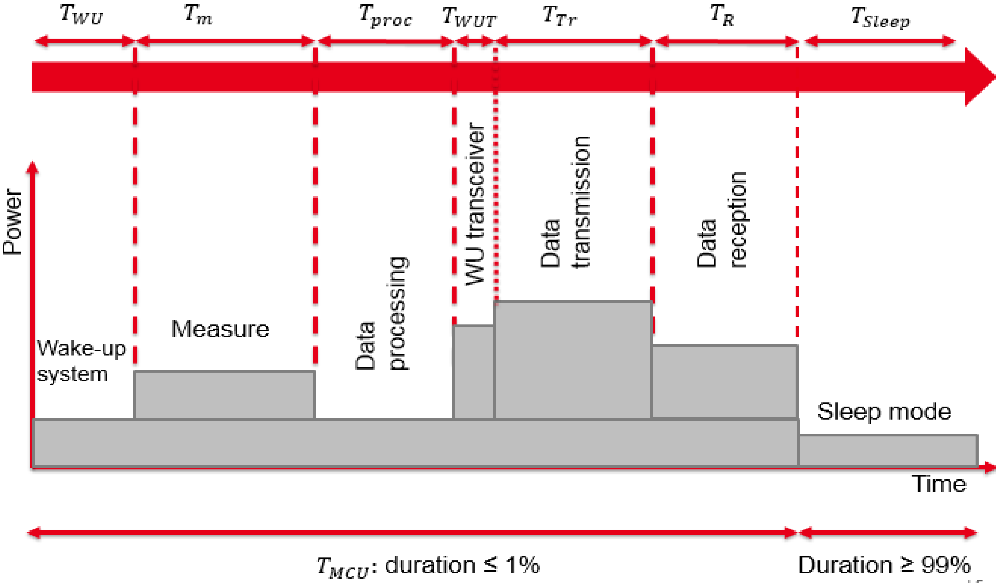
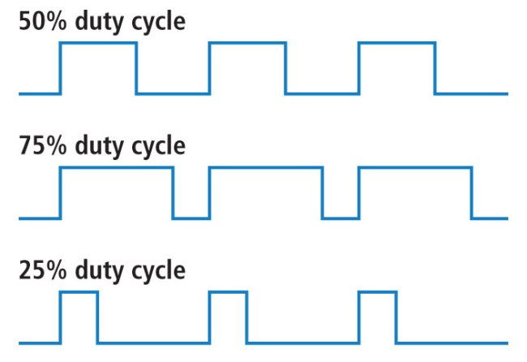
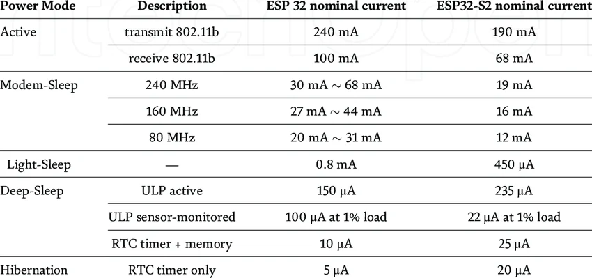
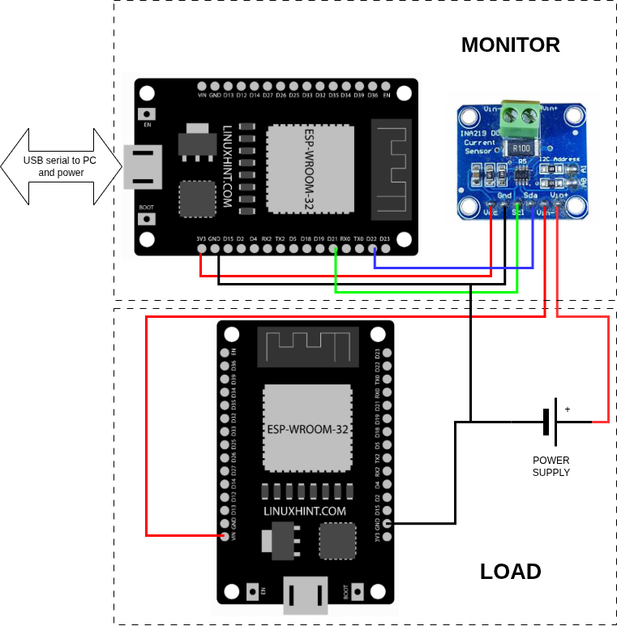
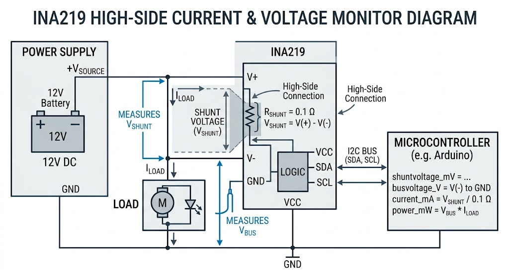
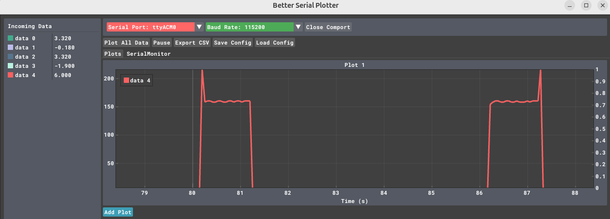

# Energy

## Power the ESP32

To power the ESP32 you can use [several methods](https://esp32io.com/tutorials/how-to-power-esp32)  skteched below:


### USB Port (Easiest & Most Common)
The most straightforward method is to plug a micro-USB or USB-C cable (depending on your board) into a computer, a 5V wall adapter (like an old phone charger), or a portable power bank. 

!!! note
    Safe, provides both power and data for programming, and is regulated on-board.
    
    Ensure you use a data-capable USB cable if you also need to upload code. 

### The 5V (or VIN) Pin
You can provide an external unregulated power supply directly to the 5V or VIN pin and a GND (ground) pin. 
Voltage Range: Typically 5V to 12V.

!!! warning
    Higher voltages (like 9V or 12V) will cause the onboard regulator to generate more heat -> energy waste.
    
    There is often no reverse polarity protection on these pins. Connecting power backward can instantly fry the board. 

### The 3.3V Pin (Regulated Power)
If you already have a stable, regulated 3.3V supply, you can connect it directly to the 3.3V and GND pins. 

!!! danger
    This method bypasses the onboard voltage regulator. If your supply exceeds 3.6V, you will damage the ESP32 chip.


!!! tip

    if you don't need 5V in you project, use 3.3V, it will save energy. However, finding suitable batteries is not easy!
    if the battery does not exceed 3.6V as in the LiFePO4, you can connect the battery to the 3.3V and bypass the voltage regulator




The Heltec V3 has a nice battery management: Integrated lithium battery management system with charge and discharge management, overcharge protection, and automatic switching between USB and battery power.

## Power consumption

The following picture from [https://doi.org/10.3390/s18072104 ](https://doi.org/10.3390/s18072104) depicts a typical sensor working scenario, where a node alternates different activities each with a different power consumption



!!! tip
    
    It is always a valuable exercise to estimate the power consumption of your app with a diagram similar to the one above. Nonetheless, it is then necessary to confirm your estimation by measurements.

## Duty cycle    
   
The duty cycle of a system is the fraction of time it is active compared to the total period.    
    


!!! exercise
    Assuming the ESP32 is powered by a 3.6V - 1000mAh LiFePO4 battery. What is a lower bound on the active time? How does it change with a 50% duty cycle?

In many systems, the device only needs to be active for a tiny fraction of each cycle (in the figure above, only 1%). That small active window lets us save a huge amount of energy, stretching the system’s operation time so it can meet the application’s needs. 

!!! tip
    
    Determining the optimal duty cycle for an application and supporting this choice with sound arguments is a fundamental aspect of the project.

## ESP32 Sleep Modes


[:fontawesome-brands-creative-commons: :fontawesome-brands-creative-commons-by:](https://www.researchgate.net/figure/Comparison-of-the-energy-consumption-of-different-ESP32-developer-modules-12_tbl1_369763204)

* **Active Mode:** Fully powered, running Wi-Fi or CPU tasks.
* **Modem-Sleep:** Wi-Fi radio is off but CPU can run. Power consumption depends on CPU frequency.
* **Light-Sleep:** CPU paused, RAM retained, low-power clocks can run.
* **Deep-Sleep:** CPU off, most peripherals off, only RTC (real-time clock) can wake up the chip.
    * ULP active: Ultra-Low-Power co-processor is active.
    * ULP sensor-monitored: Low-power monitoring using ULP at 1% load
    * RTC timer + memory: Only RTC and memory retained.
* **Hibernation:** Only RTC timer active; everything else off.

[ESP32 supports two major power saving modes](https://docs.espressif.com/projects/esp-idf/en/stable/esp32/api-reference/system/sleep_modes.html): Light-sleep and Deep-sleep.

!!!tip 
    A visual representation of these modes can be found at: [lastminuteengineers](https://lastminuteengineers.com/esp32-sleep-modes-power-consumption/)

### Light Sleep

In Light-sleep mode, the digital peripherals, most of the RAM, and CPUs are *clock-gated* and their supply voltage is reduced. Upon exit from Light-sleep, the digital peripherals, RAM, and CPUs resume operation and their internal states are preserved.

Clock gating is a power-saving technique used in digital circuits. A processor works because a clock signal tells all components when to update their state. If the clock keeps ticking, circuits keep switching—and switching consumes power. Clock gating means temporarily stopping the clock signal to parts of the circuit that aren’t doing anything. When a block (e.g. digital peripherals, RAM, and CPUs) is clock-gated, it is effectively “paused”. Its internal data (state) is kept intact, but it doesn’t switch or compute, so it saves energy.

### Deep Sleep

In Deep-sleep mode, the CPUs, most of the RAM, and all digital peripherals that are clocked from APB_CLK are powered off. The only parts of the chip that remain powered on are: RTC controller, ULP coprocessor, RTC FAST memory, RTC SLOW memory. Deep-sleep is a much more aggressive power-saving mode than Light-sleep, and the key difference is power is actually removed, not just paused.

* CPUs are completely off → The main processors stop running entirely, All execution halts. When the chip wakes up, it restarts from reset (like powering it on again), not from where it left off
* Most RAM is lost → Regular RAM is powered down → data is erased. Any variables, stack, heap, program state are gone. Only RTC FAST and SLOW memory survive → So anything you need after wake-up must be stored there (or in flash)
* Digital peripherals are off → Peripherals using APB_CLK (timers, UART, SPI, I²C, etc.) are disabled. They stop working and lose configuration → After wake-up, you must reinitialize everything

Only RTC domain stays alive. The chip keeps a tiny “always-on” subsystem:

 * RTC controller → manages sleep & wake-up
 * ULP coprocessor → can run small programs at ultra-low power
 * RTC memories → retain small amounts of data

This allows:

* Timed wake-ups (e.g., every 10 seconds)
* Sensor monitoring without waking the main CPU

### Connectivity and Sleep Modes

In Deep-sleep and Light-sleep modes, the wireless peripherals are powered down. Before entering Deep-sleep or Light-sleep modes, the application must disable Wi-Fi and Bluetooth using the appropriate calls.

If Wi-Fi/Bluetooth connections need to be maintained, enable Wi-Fi/Bluetooth Modem-sleep mode and automatic Light-sleep feature (see Power Management APIs). This allows the system to wake up from sleep automatically when required by the Wi-Fi/Bluetooth driver, thereby maintaining the connection.

### Wakeup

There are several wake-up sources available in the ESP32 sleep modes. The following resources provide excellent information for understanding ESP32 sleep modes and their power consumption.

* [Insight Into ESP32 Sleep Modes and Their Power Consumption](https://lastminuteengineers.com/esp32-sleep-modes-power-consumption/)
* [ESP32 Deep Sleep Mode](https://www.electronicwings.com/esp32/esp32-deep-sleep-mode)
* [ESP32 Deep Sleep with Arduino IDE and Wake Up Sources](https://randomnerdtutorials.com/esp32-deep-sleep-arduino-ide-wake-up-sources/)

## Deep Sleep wakeup example

1. **Deep Sleep:** The chip is off. Only the RTC controller watches the GPIO (button).
2. **Wake Up:** The button is pressed. The ESP32 boots.
3. **Setup:** We check _why_ we woke up. If it was the button, we start our tasks.
4. **Task 1:** Handles user interaction or logic.
5. **Task 2:** Performs the "Monitoring Activity" (e.g., reading a sensor).
6. **Back to Sleep:** Once the tasks finish their job, they call for deep sleep again.


```c++
#include <Arduino.h>

#define BUTTON_PIN GPIO_NUM_27 

// This variable survives deep sleep
RTC_DATA_ATTR bool should_monitor = false;

// Task 2: The Monitor
void taskMonitor(void *pvParameters) {
  if (should_monitor) {
    Serial.println("[Task 2] Monitoring activity started...");
    // Simulate sensor reading or WiFi upload
    delay(2000); 
    Serial.println("[Task 2] Monitoring complete.");
  }
  
  Serial.println("Mission accomplished. Going back to deep sleep in 1 second.");
  delay(1000);
  
  // Prepare for next sleep
  esp_sleep_enable_ext0_wakeup(BUTTON_PIN, 0); // Wake when button is LOW (pressed)
  esp_deep_sleep_start();
}

// Task 1: The Coordinator
void taskCoordinator(void *pvParameters) {
  Serial.println("[Task 1] Checking wake-up reason...");
  
  esp_sleep_wakeup_cause_t wakeup_reason = esp_sleep_get_wakeup_cause();

  if (wakeup_reason == ESP_SLEEP_WAKEUP_EXT0) {
    Serial.println("[Task 1] Woke up by Button! Signaling Task 2.");
    should_monitor = true;
  } else {
    Serial.println("[Task 1] Normal boot or other wake source.");
    should_monitor = false;
  }

  // Task 1 can now delete itself or wait
  vTaskDelete(NULL);
}

void setup() {
  Serial.begin(115200);
  pinMode(BUTTON_PIN, INPUT_PULLUP);

  // Create Task 1: Check why we woke up
  xTaskCreate(taskCoordinator, "Coordinator", 2048, NULL, 2, NULL);

  // Create Task 2: Perform monitoring if needed
  xTaskCreate(taskMonitor, "Monitor", 2048, NULL, 1, NULL);
}

void loop() {
  // Empty. Everything happens in tasks and then deep sleep.
}
```

### Ensuring Task Completion

If you put the sleep command in `setup()`, the ESP32 might go to sleep before the FreeRTOS scheduler even has a chance to start your tasks.

- **The Problem:** `setup()` runs, creates tasks, and then hits the "sleep" command immediately. The tasks never actually execute because the CPU powers down.
    
- **The Solution:** By putting the sleep command at the end of the **Monitoring Task**, we ensure that the "work" is actually finished before the lights go out.

### Key Components Explained

|**Feature**|**Function**|
|---|---|
|**`RTC_DATA_ATTR`**|Stores variables in the RTC slow memory. This is the only way Task 2 knows what Task 1 found out after a sleep cycle.|
|**`esp_sleep_enable_ext0_wakeup`**|Configures a specific GPIO to trigger the "wake up" signal while the rest of the chip is powered down.|
|**`esp_deep_sleep_start()`**|The "Off" switch. Execution stops here and the power draw drops to ~10µA.|
### Important Real-World Note

In a true FreeRTOS environment, if you want "Task 1" to trigger "Task 2" **while the chip is already awake**, you would use a **Semaphore** or **Event Group**. However, because Deep Sleep triggers a full reboot, the "trigger" here is actually the CPU reset and the shared RTC memory.

## How to measure energy consumption

### INA219 Power Monitor with ESP32

The [INA219](https://learn.adafruit.com/adafruit-ina219-current-sensor-breakout/wiring) is a high-side current shunt and power monitor with an $I^2C$ interface. It is ideal for monitoring the power consumption of battery-powered projects.


### INA219 Pinout
The INA219 module typically breaks out the following pins for power and communication.

| Pin | Function | Description |
| :--- | :--- | :--- |
| **VCC** | Power Supply | 3.3V – 5V (3.3V recommended for ESP32) |
| **GND** | Ground | Common Ground |
| **SDA** | $I^2C$ Data | Serial Data line |
| **SCL** | $I^2C$ Clock | Serial Clock line |
| **VIN+** | Input (+) | Connect to the **Positive** of the Power Source |
| **VIN-** | Output (-) | Connect to the **Positive** side of the Load |

### ESP32 Wiring Diagram
This table shows the standard $I^2C$ wiring for an ESP32 Development Board.

| INA219 Pin | ESP32 Pin | Note |
| :--- | :--- | :--- |
| **VCC** | 3.3V | Logic level matching |
| **GND** | GND | Common Ground |
| **SDA** | GPIO 21 | Default SDA |
| **SCL** | GPIO 22 | Default SCL |

### Load Connection Logic
To measure current, the sensor must be placed in **series** on the high side of your circuit.

| Connection | Direction | Target |
| :--- | :--- | :--- |
| **Power Source (+)** | → | **VIN+** |
| **VIN-** | → | **Load (+)** |
| **Load (-)** | → | **Ground** |

!!! info "Measurement Principle"
    The INA219 measures the **shunt voltage** drop across a precision resistor located between **VIN+** and **VIN-**. It then calculates the current ($I$) based on the known resistance.

<!--
In the following example, the LOAD is our ESP32 and we use the [INA219](https://learn.adafruit.com/adafruit-ina219-current-sensor-breakout/wiring) connected to an Arduino UNO to measure the power consumption. The same can be obtained using another ESP32 instead of the UNO, but remember the correct pins for SDA (default is GPIO 21) SCL (default is GPIO 22) ([See the schematics](assets/images/esp32_dev_kit_pinout_v1_mischianti.jpg))

* Connect board VIN (red wire) to Arduino 5V if you are running a 5V board Arduino (Mega, etc.). If your board is 3V, connect to that instead.
* Connect board GND (black wire) to Arduino GND
* Connect board SCL (white wire) to Arduino SCL
* Connect board SDA (blue wire) to Arduino SDA
* Connect Vin+ to the positive terminal of the power supply for the circuit under test
* Connect Vin- to the positive terminal or lead of the load
--> 

[Note on Heltec V3](https://github.com/ShotokuTech/HeltecLoRa32v3_I2C/tree/main)



```c

// use https://github.com/nathandunk/BetterSerialPlotter to visualize the data

#include <Arduino.h>
#include <Wire.h>
#include <Adafruit_INA219.h>

Adafruit_INA219 ina219;

void setup(void) 
{
  Serial.begin(115200);
  while (!Serial) {
      // will pause Zero, Leonardo, etc until serial console opens
      delay(1);
  }

  uint32_t currentFrequency;
  
  // Initialize the INA219.
  // By default the initialization will use the largest range (32V, 2A).  However
  // you can call a setCalibration function to change this range (see comments).
  if (! ina219.begin()) {
    Serial.println("Failed to find INA219 chip");
    while (1) { delay(10); }
  }
  // To use a slightly lower 32V, 1A range (higher precision on amps):
  //ina219.setCalibration_32V_1A();
  // Or to use a lower 16V, 400mA range (higher precision on volts and amps):
  //ina219.setCalibration_16V_400mA();
  Serial.println("Measuring voltage and current with INA219 ...");
}

void loop(void) 
{
  float shuntvoltage = 0;
  float busvoltage = 0;
  float current_mA = 0;
  float loadvoltage = 0;
  float power_mW = 0;

  shuntvoltage = ina219.getShuntVoltage_mV();
  busvoltage = ina219.getBusVoltage_V();
  current_mA = ina219.getCurrent_mA();
  power_mW = ina219.getPower_mW();
  loadvoltage = busvoltage + (shuntvoltage / 1000);

  Serial.print(busvoltage);
  //Serial.print(",");
  Serial.print("\t");
  Serial.print(shuntvoltage);
  //Serial.print(",");
  Serial.print("\t");
  Serial.print(loadvoltage);
  //Serial.print(",");
  Serial.print("\t");
  Serial.print(current_mA);
  //Serial.print(",");
  Serial.print("\t");
  Serial.println(power_mW);
  //Serial.println("");
  /*

  delay(50);
}


```




1. `getShuntVoltage_mV()` Voltage drop across the small $0.1 \Omega$ shunt resistor on the board. This is the raw data used to determine how much current is flowing (see `getCurrent_mA()`).
2. `getBusVoltage_V()` Voltage between the V- pin and Ground.  This tells you the nominal supply voltage to the load; doesn’t include the small drop across the shunt resistor.
3. `getCurrent_mA()` The chip takes the Shunt Voltage and divides it by the Shunt Resistance $I = \frac{V_{shunt}}{R_{shunt}}$
4. `getPower_mW()` A simple multiplication of the bus voltage and the current. $P = V_{bus} \times I$
5. `loadvoltage = busvoltage + (shuntvoltage / 1000)`This line calculates the total voltage at the source. Since there is a tiny drop across the sensor itself, the "true" source voltage is the voltage at the load plus what was lost across the shunt. Note that we divide shuntvoltage by 1000 to convert millivolts into volts so the units match.

```c

/*
  ESP32 Deep Sleep Mode Timer Wake UP
 http:://www.electronicwings.com
*/ 


#define Time_To_Sleep 5   //Time ESP32 will go to sleep (in seconds)
#define S_To_uS_Factor 1000000ULL      //Conversion factor for micro seconds to seconds 

RTC_DATA_ATTR int bootCount= 0;

void setup() {
  Serial.begin(115200);
  delay(1000); //Take some time to open up the Serial Monitor

  //Increment boot number and print it every reboot
  ++bootCount;
  Serial.println("Boot number: " + String(bootCount));

  //Set timer to 5 seconds
 esp_sleep_enable_timer_wakeup(Time_To_Sleep * S_To_uS_Factor);
  Serial.println("Setup ESP32 to sleep for every " + String(Time_To_Sleep) +
  " Seconds");

  //Go to sleep now
  esp_deep_sleep_start();
 
  Serial.println("This will not print!!"); // This will not get print,as ESP32 goes in Sleep mode.
}

void loop() {} // We don't need loop as ESP32 will initilize each time.

```


We use [Better Serial Plotter](https://github.com/nathandunk/BetterSerialPlotter) to visualize the data.




A powerful alternative is [Serial-Studio](https://github.com/Serial-Studio/Serial-Studio?tab=readme-ov-file)

!!! exercise
    Write a simple code  that  mimics the diagram at the beginning of this section of a typical sensor working scenario and measure the consumption of each activity

## Energy Harvesting

[Power ESP32/ESP8266 with Solar Panels](https://randomnerdtutorials.com/power-esp32-esp8266-solar-panels-battery-level-monitoring/)
