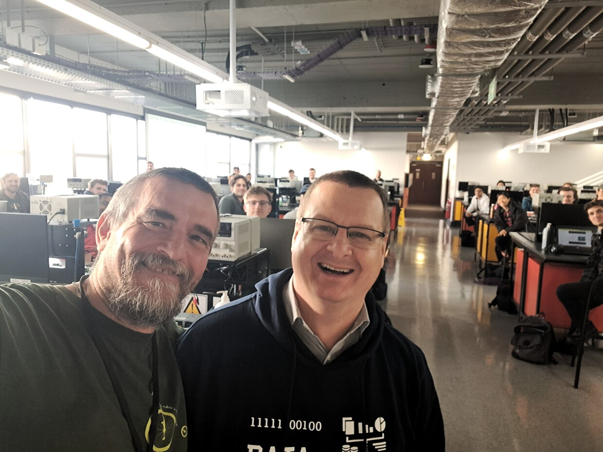
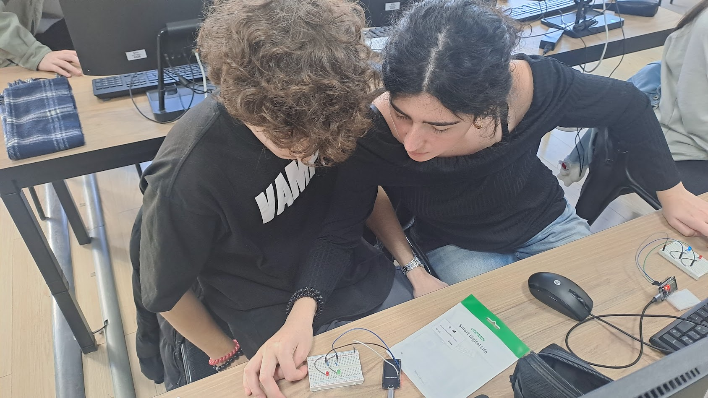

Initially this course has been conceived as a short course on IoT with the main purpose to give a first understanding of the main issues in developing IoT solutions. We do believe the most efficient way to learn this subject is experimenting, this is way the course encourage attendants to hands-on.


 No specific background is needed, even if a basic knowledge of electronics and computer science might help. 

Over the years the course evolved and it is now not so short, however, the idea is to guide the attendants step by step, incrementally.  So it is up to you how far to go. 

## Tools and Materials

The reference hardware is the [ESP32](http://esp32.net/) and we now mostly use [PlatformIO](https://platformio.org/).  
[vscode](https://code.visualstudio.com/) is a nice companion together with  the [Platformio extension](https://platformio.org/install/ide?install=vscode).

Initially we focused on [The Espressif software development environment (esp-idf)](https://docs.espressif.com/projects/esp-idf/en/latest/esp32/get-started/#) and [FREERTOS](https://www.freertos.org/). 

While this is probably the way to go for doing serious stuff, we found the Arduino framework to better suits the goal of providing a step-by-step introduction. Furthermore, Arduino on the ESP32 relies "secretely" :fontawesome-regular-face-laugh-wink: on FreeRTOS, even if to take full advantage of it, esp-idf is a must. 

The list of material for each group: 1 ESP32-DevKit, a breadboard, some wires and resistors, one led, one button, one potentiometer and one 3 Axis Accelerometer Gyroscope

* ESP32-DevKit [e.g. Available on Amazon](https://www.amazon.com/Teyleten-Robot-ESP-WROOM-32-Development-Microcontroller/dp/B08246MCL5/ref=sr_1_4?crid=ZQMHS3WU9BW9&keywords=ESP32-WROOM-32&qid=1686069281&sprefix=esp32-wroom-32%2Caps%2C234&sr=8-4)

* A breadboard [e.g. Available on Amazon](https://www.amazon.com/DEYUE-breadboard-Set-Prototype-Board/dp/B07LFD4LT6/ref=sr_1_8?crid=3R3TUY5L81TO1&keywords=breadboard&qid=1687250395&sprefix=breadboard%2Caps%2C249&sr=8-8)

* Wires [e.g. Available on Amazon](https://www.amazon.com/Elegoo-EL-CP-004-Multicolored-Breadboard-arduino/dp/B01EV70C78/ref=sr_1_3?crid=26K1OWIBE8P3T&keywords=arduino+cables&qid=1687250586&sprefix=arduino+cables%2Caps%2C172&sr=8-3)

* Resistors [e.g. Available on Amazon](https://www.amazon.com/BOJACK-Values-Resistor-Resistors-Assortment/dp/B08FD1XVL6/ref=sr_1_3?crid=LZBDO1QVNYLR&dib=eyJ2IjoiMSJ9.BNJiYWYIJ8SO47xLLe9PpgD4eBaVx_eZSZomhZak3FMoLB0G2fEG8yzkmv7QPSS9fJS6ONIcmTQgz_zJDgaDfL5WrEv7q2fgRP4QwwA1YKPwPlwNAHKBfby6iyEwJqGbn0cH_nCjsP5c67dzEXiAWOm_b7vlRAXCGuVdW4yAcyHfVipXpVQnwvktJW5WvdwgAMsRBxyZmB_NvjzqXMiYmjgtpQZWg25JzCTpOjQEPcQ.n_UpITP3IKhkA8XSBwzrFgPzt8VQdg4Sk3YBEML_pbs&dib_tag=se&keywords=resistors&qid=1725033102&sprefix=resistors%2Caps%2C245&sr=8-3&th=1)

* Minimal actuator, namely a led and resistors - resistor 330 Ohm [e.g. Available on Amazon](https://www.amazon.com/Resistor-Resistors-Assortment-Emitting-Projects/dp/B09XYRMF3V/ref=sr_1_2_sspa?crid=37V2OL06S6174&keywords=led+resistor&qid=1687250996&sprefix=led+resistor%2Caps%2C290&sr=8-2-spons&sp_csd=d2lkZ2V0TmFtZT1zcF9hdGY&psc=1)

* Minimal analog sensor, namely a potentiometer 10 KOhm [e.g. Available on Amazon](https://www.amazon.com/DGZZI-Potentiometer-Breadboard-Raspberry-3386MP-103/dp/B07ZYVS2W6/ref=sr_1_18?crid=3IYJPTJB18AST&keywords=arduino+potentiometer&qid=1687251254&sprefix=arduino+potentiometer%2Caps%2C181&sr=8-18)

* Minimal digital sensor, namely a button - resistor 1 KOhm [e.g. Available on Amazon](https://www.amazon.com/Gebildet-6%C3%976%C3%978mm-Momentary-Tactile-Breadboard/dp/B0827LX3FV/ref=sr_1_4?crid=1PDF7FKJHV3IF&dib=eyJ2IjoiMSJ9.wp8z1Vl25_OsHmBiTm-1OkkcLoKYx-o-HcT-Y6ioO4yTx5K61g-uXaDxW1H3GP9RUn_r6wcqESILLduIrLxG7Rh1o0oSBVDWePHBgcoz5jylHKKsIHdKKIHzh18hERK-HGn4nhBeWkT1d0IUSvJRFvIAxVGpeU10j1CBrojmGTMX9wM9biWMK5NYiLKZgOPmI4v_dSYTdq4uOd0OCin16eFTQwgbp1xE6ZZKihJTZus.wc4EmqTdkxjs13aWhXFIrTJ2U8BEeR0YtyVSTUQRZ6U&dib_tag=se&keywords=buttons+for+breadboards&qid=1725032022&sprefix=buttons+for+breadboards%2Caps%2C191&sr=8-4)

* {--A more interesting digital vibration sensor SW-420 [e.g. Available on Amazon](https://www.amazon.com/Hiletgo-SW-420-Vibration-Sensor-Arduino/dp/B00HJ6ACY2/ref=d_pd_day0_vft_none_sccl_3_6/144-2036444-0077312?pd_rd_w=6ZLDs&content-id=amzn1.sym.8ca997d7-1ea0-4c8f-9e14-a6d756b83e30&pf_rd_p=8ca997d7-1ea0-4c8f-9e14-a6d756b83e30&pf_rd_r=R67DPZBKK0Q1NSDSXPTR&pd_rd_wg=B8p9z&pd_rd_r=d4e20fea-fef2-4392-9e94-cb60781d285e&pd_rd_i=B00HJ6ACY2&psc=1)--}

* 3 Axis Accelerometer Gyroscope Sensor Module GY-521 MPU6050 Module[e.g. Available on Amazon](https://www.amazon.com/MPU-6050-MPU6050-Accelerometer-Gyroscope-Converter/dp/B07RXQGGJX/ref=sr_1_1?crid=3UYOU1YOSL435&dib=eyJ2IjoiMSJ9.7h53Azlf8opGeCk2tPgW8v4F_thsf_EkflAAqJpQWDYH7o4poOZuzjEmMhLFgIWQGFHo6qEv240_ohskbaGJ9L1_-aFYxXg47k9NpZ0Lp8qTroJPiRs5zYcpgy65L-k5Ch81HYtzA8r2WE5AXNtDlCzDoOwhp0GQSp7oyV3mi7vHLCrX4zGPfoh-b6MTcgkYmEwhSFmlhQ7szLaHRSXgLgbizIEjNryCGoFkpfODARs.BD9ekbawuK9Am5fxDMvZG-boNrlEDGyF2wxnXvwRamw&dib_tag=se&keywords=mpu6050&qid=1725032089&sprefix=mpu6050%2Caps%2C193&sr=8-1&th=1)
   
## Useful links

* [The Espressif software development environment](https://docs.espressif.com/projects/esp-idf/en/latest/esp32/get-started/#)
* [Arduino Ide](https://support.arduino.cc/hc/en-us/articles/360019833020-Download-and-install-Arduino-IDE)
* [PlatformIO](https://platformio.org/)
* [Wokwi](https://wokwi.com/)
* [FREERTOS](https://www.freertos.org/)
* [IoT-LAB](https://www.iot-lab.info/) 
* [Thingsboard](https://thingsboard.io/)
* [Adafruit Io](https://io.adafruit.com/)
* [A short paper on this course](assets/ashotcouresoniot.pdf)
* [Lastminuteengineers](https://lastminuteengineers.com/getting-started-with-esp32/)
* [Random Nerd Tutorial](https://randomnerdtutorials.com/projects-esp32/)
* [Arduino Learn](https://docs.arduino.cc/learn/)
* [Andreas Spiess Youtube channel](https://www.youtube.com/@AndreasSpiess)

## Editions

Some material of this course is used in the Sapienza University of Rome course on [Internet of Thing Algorithms and Services](http://ichatz.me/Site/InternetOfThings2025) 

First edition of the course 19th (Session 1 and 2) and 21st (Session 3 and 4) of July 2023 in the University of Stellenbosch (South Africa) during an [Erasmus+](https://erasmus-plus.ec.europa.eu/resources-and-tools/mobility-and-learning-agreements/mobility-agreements) staff mobility for teaching visit. About 40 participants selected among more the 100 candidates. 



Second edition of the course 25th, 29th and 31st Of October and 4th of November 2024 in the [Business and Technology University](https://btu.edu.ge/en/home-english/) (Tbilisi, Georgia) during an [Erasmus+](https://erasmus-plus.ec.europa.eu/resources-and-tools/mobility-and-learning-agreements/mobility-agreements) staff mobility for teaching visit. Two groups of 10 students each. 




<!--

TRICKS

  - pymdownx.snippets:
      check_paths: true
      url_download: true

```c
--8<-- "https://raw.githubusercontent.com/andreavitaletti/IoT4PD/refs/heads/master/code/mqtt_esp8266_basic/mqtt_esp8266_basic.ino"
```

-->
