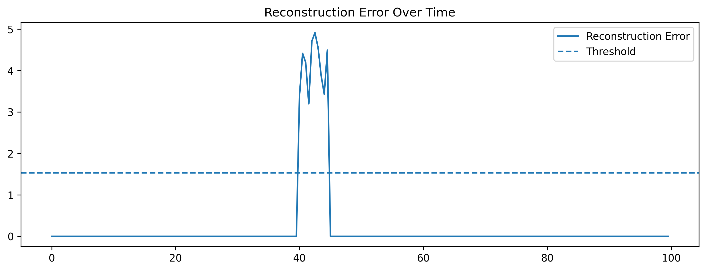

# ML Playground

[https://playground.scienxlab.org/](https://playground.scienxlab.org/)
[https://mlplaygrounds.com/machine/learning/linearRegression.html](https://mlplaygrounds.com/machine/learning/linearRegression.html)

# Tensorflow Lite Micro on ESP32 

Reference examples are available [here](https://github.com/espressif/tflite-micro-esp-examples). You have to download from github [esp-nn](https://github.com/espressif/esp-nn) and [esp32-camera](https://github.com/espressif/esp32-camera) and place them into the relative folders under components.

Then go to examples/hello_worlds and as usual idf.py build, idf.py flash and finally idf.py monitor.

A nice explanation on how the model is generated can be found on the book [TinyML by Pete Warden, Daniel Situnayake](https://www.oreilly.com/library/view/tinyml/9781492052036/ch04.html). The corresponding jupyter notebook is available [here](https://colab.research.google.com/github/goodboychan/goodboychan.github.io/blob/main/_notebooks/2020-09-24-01-Training-Hello-world-Model-for-Microcontroller.ipynb)

Some other useful resources are listed below:

* [First steps with ESP32 and TensorFlow Lite for Microcontrollers](https://medium.com/@dmytro.korablyov/first-steps-with-esp32-and-tensorflow-lite-for-microcontrollers-c2d8e238accf)
* [Get started with microcontrollers](https://www.tensorflow.org/lite/microcontrollers/get_started_low_level)

## Anomaly detection

Build a **real-time anomaly detector** that identifies unusual patterns in sensor data (e.g., temperature, vibration, or audio) directly on the ESP32 using TinyML.

---

## Step 1: Choose a dataset / sensor

Some options suitable for ESP32 sensors:

|Sensor type|Example dataset / task|Notes|
|---|---|---|
|Accelerometer|Detect unusual movement of a device (falling, shaking)|Use onboard MPU6050|
|Temperature|Detect abnormal temperature spikes|Simple, easy for TinyML|
|Microphone|Detect unusual sounds (e.g., clapping, alarm)|Use I2S mic, feasible with Edge Impulse|
|Vibration|Predict machine anomalies|Requires IMU or piezo sensor|
## Step 2: Define the anomaly detection approach

There are several approaches suitable for TinyML:

1. **Statistical thresholding**
    - Keep a running mean & standard deviation of sensor readings.
    - Flag readings that are >2–3σ from the mean.
    - Pros: very light, easy on ESP32 RAM.
    - Cons: sensitive to noise.
2. **One-class ML model**
    - Train a model only on “normal” data, flag anything deviating.
    - TinyML-compatible options:
        - **TensorFlow Lite for Microcontrollers (TFLM)** with a small fully connected NN
        - **Isolation Forest** (can be converted to tiny NN)
        - **Autoencoder**: small network compressing and reconstructing input, high reconstruction error → anomaly
3. **TinyML library examples**
    - **Edge Impulse Anomaly Detection**: supports accelerometer, microphone, temp sensors. Generates ready-to-deploy TFLite micro models for ESP32.

## Step 3: Preprocessing & feature extraction

Depending on the sensor:

|Sensor|Features|
|---|---|
|Accelerometer|RMS, mean, variance, FFT energy|
|Temperature|Rolling mean, slope, variance|
|Microphone|MFCCs, energy, zero-crossing rate|
|Vibration|RMS, spectral centroid, peak-to-peak|

> Keep the features small (<10–20 floats) to fit TinyML models on ESP32.

## Step 4: Train the model

1. Collect “normal” data with ESP32 or simulate in Python.
2. Train a tiny autoencoder or fully connected NN (e.g., 2–3 hidden layers, 16–32 neurons each).
3. Convert to **TensorFlow Lite for Microcontrollers**.
4. Load onto ESP32 using Arduino, PlatformIO, or ESP-IDF.

---

## Step 5: Run inference on ESP32

- Sample the sensor every X ms (e.g., 100 ms).
- Feed the features to the TinyML model.
- Compute anomaly score:
    - Autoencoder: `score = ||input - reconstructed||`
    - Threshold: if score > threshold → anomaly
- Optional: trigger an LED, buzzer, or send a message via Wi-Fi/LoRa.
    

---

## Exercise 

1. Collect **1 minute of normal temperature data** from ESP32 sensor.
2. Train a **TinyML autoencoder** on this data.
3. Introduce a **synthetic anomaly** (e.g., sudden spike).
4. Deploy model on ESP32.
5. Detect anomaly **in real time** and light up LED.
6. Optional challenge: add **wireless logging** of anomalies to a server.

## Python / TensorFlow – Training the Autoencoder

```python

import tensorflow as tf

import numpy as np

# 1.0 Create dummy data (Normal = 20-30 degrees)
#data = np.random.uniform(20, 30, (1000, 1)).astype('float32')

# 1.1 Mean of 25 degrees, standard deviation of 2
data = np.random.normal(25, 2, (1000, 1)).astype('float32')
# Clip it to ensure it stays within reasonable physical bounds
data = np.clip(normal_data, 15, 35)

# 2. Define the Autoencoder
model = tf.keras.Sequential([
tf.keras.layers.Input(shape=(1,)),
tf.keras.layers.Dense(4, activation='relu'), # Encoder
tf.keras.layers.Dense(1, activation='linear') # Decoder
])

model.compile(optimizer='adam', loss='mse')
model.fit(data, data, epochs=50, verbose=0)

#######################################################################

# 3. Convert to TFLit
converter = tf.lite.TFLiteConverter.from_keras_model(model)
tflite_model = converter.convert()

# 4. Save as a C header file
with open("model_data.h", "wb") as f:
	f.write(b"const unsigned char autoencoder_model_data[] = {\n")

	# Convert binary to hex strings
	hex_data = [f"0x{b:02x}" for b in tflite_model]
	f.write(", ".join(hex_data).encode())
	f.write(b"\n};\n")
	f.write(f"const unsigned int autoencoder_model_data_len = {len(tflite_model)};".encode())

```

This trains a tiny autoencoder on "normal" temperature values. A convenient way to make a test is to use Colab

```python

test_anomaly = np.array([[50.0]]) # Way too hot!
prediction = model.predict(test_anomaly)
print(f"Input: 50.0, Reconstruction: {prediction[0][0]}, Error: {abs(50.0 - prediction[0][0])}")

```

Adding **Normalization** is the "secret sauce" for neural networks.

```python

import numpy as np
import tensorflow as tf

# Define expected range
MIN_TEMP = 10.0
MAX_TEMP = 40.0

def normalize(val):
    return (val - MIN_TEMP) / (MAX_TEMP - MIN_TEMP)

# Generate normal training data (20 to 30 degrees)
raw_data = np.random.normal(25, 2, (1000, 1)).astype('float32')
normalized_data = normalize(raw_data)

# Simple Autoencoder
model = tf.keras.Sequential([
    tf.keras.layers.Input(shape=(1,)),
    tf.keras.layers.Dense(8, activation='relu'), 
    tf.keras.layers.Dense(1, activation='sigmoid') # Sigmoid forces output 0-1
])

model.compile(optimizer='adam', loss='mse')
model.fit(normalized_data, normalized_data, epochs=50, verbose=0)

# Export... (use the same conversion script as before)

```

## Arduino / ESP32 – Load & Run TFLite Model

```c
#include <Arduino.h>
#include "model_data.h" // Must contain autoencoder_model_data and autoencoder_model_data_len

// TensorFlow Lite Micro Headers
#include "tensorflow/lite/micro/all_ops_resolver.h"
#include "tensorflow/lite/micro/micro_interpreter.h"
#include "tensorflow/lite/micro/micro_error_reporter.h"
#include "tensorflow/lite/schema/schema_generated.h"

// --- Configuration ---
#define SENSOR_PIN 34
#define LED_PIN 2

// Normalization constants (Must match your Python script!)
const float MIN_TEMP = 10.0;
const float MAX_TEMP = 40.0;
const float ANOMALY_THRESHOLD = 0.15; // 15% reconstruction error

// --- TFLM Globals ---
// Alignment is crucial for ESP32/ARM performance
alignas(16) uint8_t tensor_arena[15 * 1024]; 

tflite::MicroInterpreter* interpreter = nullptr;
TfLiteTensor* input = nullptr;
TfLiteTensor* output = nullptr;
static tflite::MicroErrorReporter error_reporter;

void setup() {
    Serial.begin(115200);
    pinMode(LED_PIN, OUTPUT);
    delay(1000);

    Serial.println("Initializing Anomaly Detector...");

    // 1. Load the Model
    const tflite::Model* model = tflite::GetModel(autoencoder_model_data);
    if (model->version() != TFLITE_SCHEMA_VERSION) {
        Serial.println("Model schema mismatch!");
        while (1);
    }

    // 2. Resolver (Registers the layers like Dense, Relu)
    static tflite::AllOpsResolver resolver;

    // 3. Create Interpreter
    static tflite::MicroInterpreter static_interpreter(
        model, resolver, tensor_arena, sizeof(tensor_arena), &error_reporter);
    
    interpreter = &static_interpreter;

    // 4. Allocate memory for tensors
    TfLiteStatus allocate_status = interpreter->AllocateTensors();
    if (allocate_status != kTfLiteOk) {
        Serial.println("AllocateTensors() failed! Increase arena size.");
        while (1);
    }

    // 5. Get pointers to input/output buffers
    input = interpreter->input(0);
    output = interpreter->output(0);

    Serial.println("System Ready. Monitoring Sensor...");
}

void loop() {
    // --- 1. Data Acquisition & Scaling ---
    // Read 12-bit analog (0-4095) and convert to Celsius (example math)
    float raw_voltage = analogRead(SENSOR_PIN) * (3.3 / 4095.0);
    float raw_temp = (raw_voltage * 10.0) + 20.0; 

    // Normalize to 0.0 - 1.0 (Same as Python!)
    float normalized_input = (raw_temp - MIN_TEMP) / (MAX_TEMP - MIN_TEMP);
    
    // Safety clip to keep input within 0.0 and 1.0
    if (normalized_input < 0.0f) normalized_input = 0.0f;
    if (normalized_input > 1.0f) normalized_input = 1.0f;

    // --- 2. Inference ---
    input->data.f[0] = normalized_input;

    TfLiteStatus invoke_status = interpreter->Invoke();
    if (invoke_status != kTfLiteOk) {
        Serial.println("Inference failed!");
        return;
    }

    float normalized_output = output->data.f[0];

    // --- 3. Anomaly Logic ---
    // Reconstruction error = |Input - Output|
    float anomaly_score = abs(normalized_input - normalized_output);

    // Convert reconstruction back to Celsius for display
    float recon_temp = (normalized_output * (MAX_TEMP - MIN_TEMP)) + MIN_TEMP;

    // --- 4. Reporting ---
    Serial.print("Real: "); Serial.print(raw_temp);
    Serial.print(" | Recon: "); Serial.print(recon_temp);
    Serial.print(" | Score: "); Serial.println(anomaly_score, 4);

    if (anomaly_score > ANOMALY_THRESHOLD) {
        Serial.println(">>> ANOMALY DETECTED! <<<");
        digitalWrite(LED_PIN, HIGH);
    } else {
        digitalWrite(LED_PIN, LOW);
    }

    delay(500); // 2Hz sampling
}

```


1. In the context of an **Autoencoder**, an anomaly is detected when the model **fails to recreate the input accurately**. Anomaly Score == ∣∣x−x^∣∣ (see below)
2. Very lightweight: **fits ESP32 with ~2 KB tensor arena**.

## Why Autoencoder?

We want to **detect anomalies** in sensor data, e.g., temperature spikes, unusual vibration, or abnormal movement patterns.

Key points:

- **Normal data is abundant**
- **Anomalies are rare** or hard to label in advance

This is a classic **unsupervised anomaly detection problem**.

An **autoencoder** is a neural network trained to **reconstruct its input**:

`Input x  →  Encoder → Latent Space → Decoder → Output x̂ (reconstruction)`

- It **learns the patterns of “normal” data**.
- If you feed it a **normal sample**, it reconstructs it accurately → low reconstruction error.
- If you feed it an **anomalous sample**, it cannot reconstruct it well → high reconstruction error.

So the **reconstruction error** can be used as an **anomaly score**:

Anomaly Score == ∣∣x−x^∣∣

|Advantage|Why it matters for ESP32|
|---|---|
|**Lightweight**|A small autoencoder (few layers, few neurons) can run on a microcontroller.|
|**No labeled anomalies needed**|Only needs normal data to train. Useful because anomalies are rare.|
|**Generalizable**|Can detect anomalies that were not seen during training.|
|**Simple inference**|Forward pass only → low latency → real-time detection.|
## Alternative approaches vs autoencoder

|Method|Pros|Cons for ESP32|
|---|---|---|
|Statistical threshold (mean ± 3σ)|Very light|Doesn’t capture complex patterns; sensitive to noise|
|One-class SVM|Can capture nonlinear boundaries|Memory-heavy; slower inference|
|Isolation Forest|Good for multidimensional data|Not trivial to run on microcontrollers|
|Autoencoder|Captures complex patterns, light|Needs tiny neural network tuning|

✅ Autoencoder is a **perfect balance** between capability and feasibility for TinyML on microcontrollers.

## Intuition

Think of it like this:

- Autoencoder learns a **“normal sensor behavior fingerprint.”**
- Anything that deviates from that fingerprint → flagged as anomaly.    
- Works for **time series**, **multivariate data**, or even **audio features (MFCCs)**.

```pgsql

         Normal Data                 Anomalous Data
       ----------------          ----------------
       Temp = 25 ± 0.5             Temp spike = 30
           |                            |
           v                            v
      +-------------+             +-------------+
      |   Encoder   |             |   Encoder   |
      +-------------+             +-------------+
           |                            |
           v                            v
     Latent representation         Latent representation
           |                            |
           v                            v
      +-------------+             +-------------+
      |   Decoder   |             |   Decoder   |
      +-------------+             +-------------+
           |                            |
           v                            v
      Reconstructed Temp = 25 ± 0.5   Reconstructed Temp ≈ 25.1
           |                            |
           v                            v
   Reconstruction error ≈ 0        Reconstruction error ≈ 4.9
           |                            |
           v                            v
   ✅ Normal                       ⚠️ Anomaly detected

```

- **Normal Data**
    - Autoencoder is trained on “normal” temperature readings (~25°C).
    - Encoder compresses input → decoder reconstructs it almost perfectly.
    - **Reconstruction error ≈ 0 → Not an anomaly.**
- **Anomalous Data**
    - Temperature suddenly spikes to 30°C.
    - Autoencoder has **never seen this pattern**, so reconstruction fails.
    - **Reconstruction error is high → anomaly detected.**

- Works **without labeled anomalies**    
- **Lightweight computation**: forward pass only
- Can extend to **multivariate input** (temperature + humidity + vibration)
- Threshold on reconstruction error decides **anomaly vs normal**




