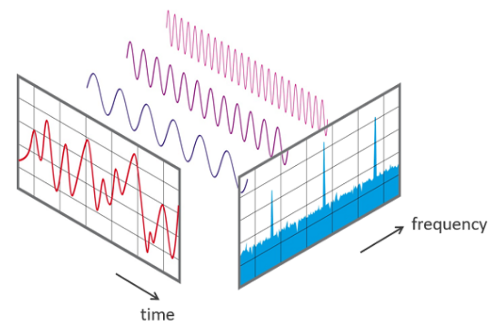
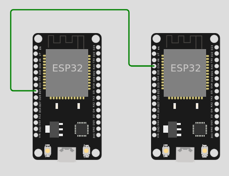
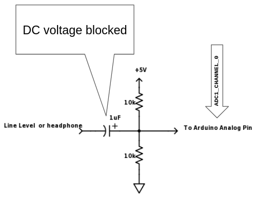
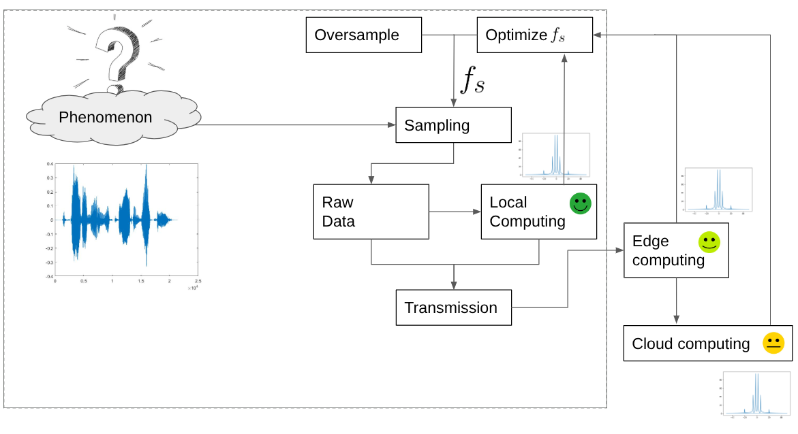

# Sample the environment

Usually IoT applications need to observe a physical phenomenon. This is done by sampling.

## Sampling? How often: Fast Fourier Transform (FFT)



[Colab Notebook on FFT](https://colab.research.google.com/drive/1nuZx095lzt2d9h42N7yNu13crGg9eS9A)

## A simple experimental setup

:fontawesome-brands-github: [https://github.com/andreavitaletti/PlatformIO/tree/main/Projects/virtual%20sensor](https://github.com/andreavitaletti/PlatformIO/tree/main/Projects/virtual%20sensor)

A virtual signal is a practical approach to generate "arbitrary" signals using one EPS32 as the signal generator, and the other as the sampler. 

The two ESP32 are connected as in the following picture



The node on the left works as a **virtual signal**, it generates a signal using the [DAC](https://www.electronicwings.com/esp32/dac-digital-to-analog-converter-esp32) on PIN 25. 
The node on the right sample the generated signal by the [ADC](https://www.electronicwings.com/esp32/adc-of-esp32)  on pin 34

| **ESP32 A (Sender)** | **Connection Type**   | **ESP32 B (Receiver)** | **Purpose**      |
| -------------------- | --------------------- | ---------------------- | ---------------- |
| **GPIO25** (DAC1)    | $\rightarrow$         | **GPIO34** (ADC1)      | Signal Path      |
| **GND**              | $\longleftrightarrow$ | **GND**                | Common Reference |
| **USB Power**        |                       | **USB Power**          | Power Supply     |

### ESP32 A: The Generator (Sender)

The straightforward implementation 

```c++

#include <Arduino.h>

// Define the DAC and ADC pins
const int dacPin = 25;   // DAC1 (GPIO 25) for sinusoid output


// Parameters for the sine wave
const int amplitude = 100;   // Amplitude of the sine wave (max 255 for 8-bit DAC)
const int offset = 128;      // DC offset (middle of the DAC range)
const float signalFrequency = 5.0;  // Frequency of the sine wave in Hz
int samplingFrequencyDAC = 1000; // sampling theorem should be at least 2*frequency


void setup() {
  Serial.begin(115200);

  // Initialize DAC pin (GPIO 25)
  dacWrite(dacPin, 0);  // Initialize DAC with a low value

}

void loop() {
      for (int i = 0; i < samplingFrequencyDAC; i++) {
      int sineValue = (int)(amplitude * sin(2.0 * PI * signalFrequency * i / samplingFrequencyDAC) + offset);
      dacWrite(dacPin, sineValue);  // Write to DAC (8-bit value)
      /*
      Serial.print(">");
      Serial.print("dac:");    
      Serial.println(sineValue);
      */
      delay(round(1.0/samplingFrequencyDAC*1000)); // in milliseconds
      } 
    
}

```

The following code uses a pre-calculated lookup table to store sine values. This is  more efficient than calculating `sin()` on the fly, allowing for a smoother signal.

```C++
// ESP32 SENDER CODE
#include <Arduino.h>

#define DAC_PIN 25 // Uses DAC Channel 1
const int tableSize = 256;
uint8_t sineTable[tableSize];

void setup() {
  // Generate a sine lookup table (0 to 255)
  // We scale it slightly (20-230) to stay in the DAC's linear range
  for (int i = 0; i < tableSize; i++) {
    sineTable[i] = (uint8_t)(127 + 100 * sin(2 * PI * i / tableSize));
  }
}

void loop() {
  for (int i = 0; i < tableSize; i++) {
    dacWrite(DAC_PIN, sineTable[i]);
    delayMicroseconds(100); // Adjust this to change frequency
  }
}
```

The frequency is calculated by how long it takes to step through all **256 points** of the lookup table.

- **Delay per step:** `100 microseconds` ($\mu s$)
- **Total steps:** 256
- **Time for 1 full wave ($T$):** $256 \times 100 \mu s = 25,600 \mu s$ (or **0.0256 seconds**)

To find the frequency ($f$), we use:

$$f = \frac{1}{T} = \frac{1}{0.0256} \approx 39 \text{ Hz}$$

!!! note

	The actual frequency will be slightly lower (closer to **37-38 Hz**) because the `dacWrite()` function and the `for` loop overhead add a few extra microseconds per step.

---
### ESP32 B: The Receiver (Sampler)

This code reads the signal and prints it to the Serial interface. Note the use of `analogReadAttenuation`, which sets the voltage range to approximately 0V–3.1V to better match the DAC output.

```c++
// ESP32 RECEIVER CODE
#include <Arduino.h>

#define ADC_PIN 34 // ADC1_CH6

void setup() {
  Serial.begin(115200);
  // Set attenuation to 11dB (allows 0V - 3.1V range)
  analogSetAttenuation(ADC_11db); 
}

void loop() {
  int rawValue = analogRead(ADC_PIN); // from 0 to 4095  
  // Print to Serial 
  Serial.println(rawValue);
  delayMicroseconds(500); // Sample rate control
}
```


The ESP32's `analogRead()` takes about **10µs to 20µs**. If you find the wave looks "steppy" or jagged, it’s usually due to electrical noise or the sampling interval. If you want to go faster (into the kHz range), the `dacWrite` method used here will eventually hit a bottleneck.

The sampling frequency ($f_s$) is how many times per second the ADC "looks" at the incoming voltage.

- **Delay per sample:** `500 microseconds` ($\mu s$)
- **ADC conversion time:** approx. `10-20 microseconds`
- **Serial print time:** approx. `50-100 microseconds` (at 115200 baud)

Total time per sample is roughly **600 $\mu s$**.

$$f_s = \frac{1}{600 \times 10^{-6}} \approx 1,666 \text{ Hz} \text{ (or 1.6 kHz)}$$

---

### Is sampling frequency sufficient?

According to the **Nyquist-Shannon Sampling Theorem**, your sampling frequency must be at least **twice** the signal frequency to avoid "aliasing" (where the signal looks like a completely different wave).

- **Signal:** ~39 Hz
- **Sampler:** ~1,666 Hz
- **Oversampling Ratio:** ~42x

A 42x oversampling ratio means you will get a very high-fidelity reconstruction of the sine wave on your Serial.

!!! question "exercise"

	Use a Serial Plotter (such as [Better Serial Plotter](https://github.com/nathandunk/BetterSerialPlotter)) to plot the signal

!!! question "exercise"

	Write a FreeRTOS program running two tasks: one to generate the signal, the other to sample it

### A possible alternative using the PC



[ref](https://forum.arduino.cc/t/how-to-read-data-from-audio-jack/458301/3)

``` python3 -m pip install sounddevice ```

```python

# Use the sounddevice module
# http://python-sounddevice.readthedocs.io/en/0.3.10/

import numpy as np
import sounddevice as sd
import time

# Samples per second
sps = 44100

# Frequency / pitch
freq_hz = 2

# Duration
duration_s = 5.0

# Attenuation so the sound is reasonable
atten = 1.0 # 0.3

# NumpPy magic to calculate the waveform
each_sample_number = np.arange(duration_s * sps)
waveform = np.sin(2 * np.pi * each_sample_number * freq_hz / sps)
waveform_quiet = waveform * atten

# Play the waveform out the speakers
sd.play(waveform_quiet, sps)
time.sleep(duration_s)
sd.stop()

```

[Online Tone Generator](https://onlinetonegenerator.com/)

## The Sampler in  FreeRTOS

:fontawesome-brands-github:  [https://github.com/andreavitaletti/PlatformIO/tree/main/Projects/FFT](https://github.com/andreavitaletti/PlatformIO/tree/main/Projects/FFT)

Two tasks, one samples the environment the other performs a computation on the samples, specifically the FFT

```c++

#include <arduinoFFT.h>
#include <math.h>

#define SAMPLES 1024
#define SAMPLING_FREQUENCY 1000 // Reduced for stability during testing

double vReal[SAMPLES];
double vImag[SAMPLES];
TaskHandle_t FFTTaskHandle = NULL;
ArduinoFFT<double> FFT = ArduinoFFT<double>(vReal, vImag, SAMPLES, SAMPLING_FREQUENCY);


void TaskSample(void *pvParameters) {
  // Use a lower priority or ensure we don't starve the IDLE task
  const double TARGET_FREQ = 100.0;
  const double AMPLITUDE = 50.0;

  while (1) {
    for (int i = 0; i < SAMPLES; i++) {
      // Calculate synthetic sine
      float time = (float)i / (float)SAMPLING_FREQUENCY;
      vReal[i] = AMPLITUDE * sin(2.0 * M_PI * TARGET_FREQ * time);
      // vReal[i] = analogRead(34); // Read from GPIO 34
      vImag[i] = 0;
      
      // CRITICAL: Small delay to prevent Watchdog Trigger
      // If SAMPLING_FREQUENCY is low, this works fine.
      vTaskDelay(pdMS_TO_TICKS(1)); 
    }
    
    xTaskNotifyGive(FFTTaskHandle);
    
    // Give the CPU a breather between buffers
    vTaskDelay(pdMS_TO_TICKS(10));
  }
}

void TaskFFT(void *pvParameters) {
  while (1) {
    ulTaskNotifyTake(pdTRUE, portMAX_DELAY);

    FFT.windowing(FFT_WIN_TYP_HAMMING, FFT_FORWARD);
    FFT.compute(FFT_FORWARD);
    FFT.complexToMagnitude();

    Serial.printf("Peak: %.2f Hz\n", FFT.majorPeak());
  }
}

void setup() {
  Serial.begin(115200);
  delay(1000); // Give serial time to start

  // Increased stack size to 8192 to prevent Stack Overflow
  xTaskCreatePinnedToCore(TaskSample, "Sampler", 8192, NULL, 1, NULL, 1);
  xTaskCreatePinnedToCore(TaskFFT, "FFT_Proc", 8192, NULL, 1, &FFTTaskHandle, 0);
}

void loop() {
  vTaskDelete(NULL);
}

```

!!! warning

	FFT.majorPeak() is not what you need to find out the max frequency

!!! question "Exercise"

	Instead of using a single buffer use two: while one is filled up the other is analysed. Update the code to compute the max frequency


## How to go faster

In previous sections we achieve Hz frequencies, If you want to reach **Kilohertz** signal frequencies, the `delayMicroseconds()` approach becomes ineffective because the overhead (the time it takes to process the loop) becomes a large percentage of the total time. That is when we switch to **I2S (Inter-IC Sound)**, which uses a hardware clock to "push" data to the DAC or "pull" it from the ADC at exact intervals, like a metronome.

Instead of the CPU manually toggling the DAC or reading the ADC in a loop, the I2S hardware uses a dedicated clock to stream data in the background. This allows for frequencies in the **kilohertz (kHz)** range with perfect timing.

On the ESP32, the I2S peripheral can be "routed" directly to the internal DAC and ADC.

---
### The High-Speed Generator (Sender)

This code configures I2S to "pump" a sine wave out of the DAC at a high sample rate. Note that for I2S to DAC, we use a 16-bit buffer even though the DAC is 8-bit (the hardware expects it this way).


```c++
#include "driver/i2s.h"
#include <math.h>

#define SAMPLE_RATE     44100 // 44.1 kHz (CD Quality)
#define SINE_FREQ       440.0 // Standard A4 note
#define I2S_NUM         I2S_NUM_0

void setup() {
  i2s_config_t i2s_config = {
    .mode = (i2s_mode_t)(I2S_MODE_MASTER | I2S_MODE_TX | I2S_MODE_DAC_BUILT_IN),
    .sample_rate = SAMPLE_RATE,
    .bits_per_sample = I2S_BITS_PER_SAMPLE_16BIT,
    .channel_format = I2S_CHANNEL_FMT_ONLY_RIGHT,
    .communication_format = I2S_COMM_FORMAT_STAND_I2S,
    .intr_alloc_flags = 0,
    .dma_buf_count = 8,
    .dma_buf_len = 64,
    .use_apll = false
  };

  i2s_driver_install(I2S_NUM, &i2s_config, 0, NULL);
  i2s_set_dac_mode(I2S_DAC_CHANNEL_BOTH_EN); // Enables GPIO25 and 26
}

void loop() {
  static float phase = 0;
  uint16_t sample;
  size_t bytes_written;

  // Generate 1 sample of sine wave
  float val = sin(phase);
  sample = (uint16_t)((val + 1.0) * 127); // Scale -1.0..1.0 to 0..254
  sample <<= 8; // I2S DAC expects high byte

  i2s_write(I2S_NUM, &sample, sizeof(sample), &bytes_written, portMAX_DELAY);

  phase += 2 * PI * SINE_FREQ / SAMPLE_RATE;
  if (phase >= 2 * PI) phase -= 2 * PI;
}
```

---

### The High-Speed Sampler (Receiver)

The receiver uses I2S to read from the ADC. This is much faster than `analogRead()`.

```c++
#include "driver/i2s.h"

#define SAMPLE_RATE 44100
#define I2S_NUM     I2S_NUM_0

void setup() {
  Serial.begin(115200);

  i2s_config_t i2s_config = {
    .mode = (i2s_mode_t)(I2S_MODE_MASTER | I2S_MODE_RX | I2S_MODE_ADC_BUILT_IN),
    .sample_rate = SAMPLE_RATE,
    .bits_per_sample = I2S_BITS_PER_SAMPLE_16BIT,
    .channel_format = I2S_CHANNEL_FMT_ONLY_RIGHT,
    .communication_format = I2S_COMM_FORMAT_STAND_I2S,
    .intr_alloc_flags = 0,
    .dma_buf_count = 8,
    .dma_buf_len = 64,
    .use_apll = false
  };

  i2s_driver_install(I2S_NUM, &i2s_config, 0, NULL);
  i2s_set_adc_mode(ADC_UNIT_1, ADC1_CHANNEL_6); // GPIO34
  i2s_adc_enable(I2S_NUM);
}

void loop() {
  uint16_t buffer[64];
  size_t bytes_read;

  // Read a block of samples from the DMA buffer
  i2s_read(I2S_NUM, &buffer, sizeof(buffer), &bytes_read, portMAX_DELAY);

  // Print just the first sample of each block to Serial  (to avoid flooding)
  Serial.println(buffer[0] & 0x0FFF); // Mask 12 bits for ADC
}
```

### Why this is better

1. **DMA (Direct Memory Access):** The I2S hardware uses DMA. This means it writes directly to a chunk of memory (the buffer) without the CPU having to intervene for every single bit.
    
2. **No Jitter:** In your previous code, if the CPU was busy doing a background Wi-Fi task, the sine wave would "hiccup." With I2S, the clock is generated by hardware, so the timing is rock-solid.
    
3. **Efficiency:** You can now generate or sample audio at **44,100 Hz** (or even higher) while the CPU is free to do other things, like processing a FFT (Fast Fourier Transform).
    

### One Final Caveat

At 44.1 kHz, the **Serial Plotter** will struggle to keep up if you print every single point. That's why the receiver code above only prints one sample from every buffer "chunk." If you want to see the full wave at high speed, you'd usually store a large buffer and then "dump" it to the serial port all at once.
### Other experiments

1. **Change the Sender Frequency**   
2. **Add Noise:** Try touching the signal wire with your finger. You'll see the "noise floor" (the messy small bumps at the bottom of the graph) jump up.
3. **Square Wave:** Change the Sender to output a square wave instead of a sine wave. In the FFT, you will see the **fundamental frequency** plus a series of "harmonics" (smaller peaks at 3x, 5x, and 7x the frequency).

## A reference scenario



1. You initially oversample at the max speed
2. Then you comute the FFT to extract the $f_{max}$ . The more you can compute locally, the “better” it is. Of course, this depends on the application, but the principle is always the same: local computation is harder, yet more energy-efficient… the very essence of our course!
3. Adjust the sampling frequency to $f_s > 2 \cdot f_{max}$

!!! note
    
    We can now correctly reconstract the signal with an approproate $f_s$ . This is also useful to define the correct duty-cycle to reduce energy consumption (see [here](energy.md))
