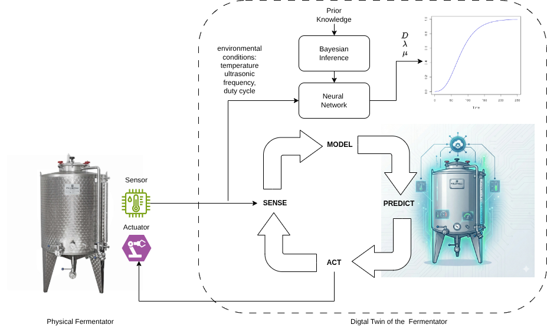
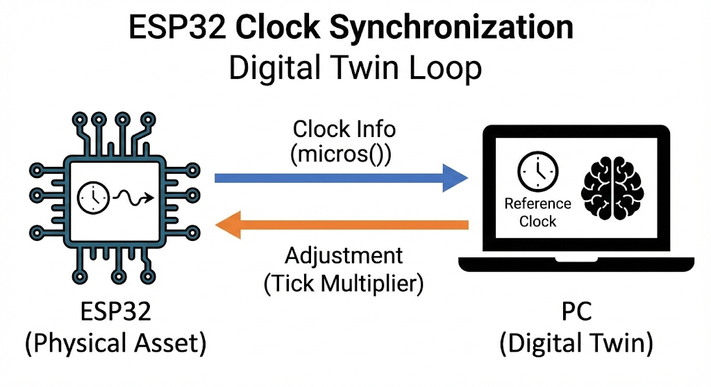
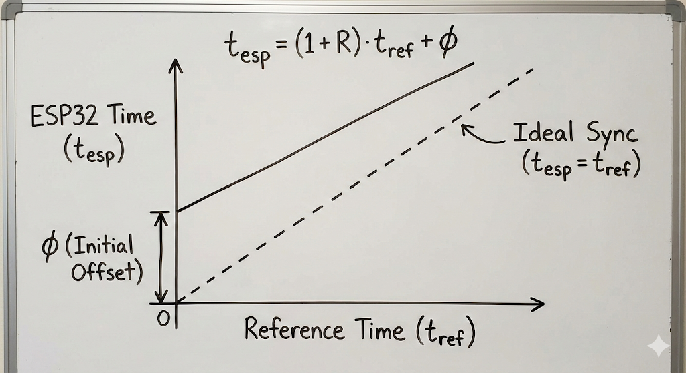
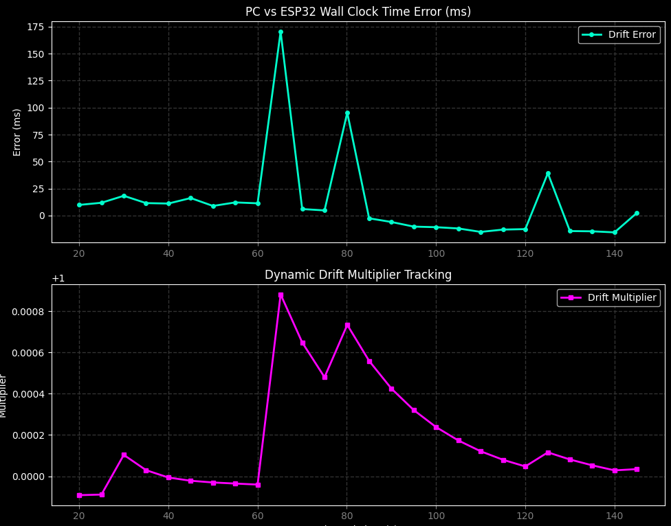
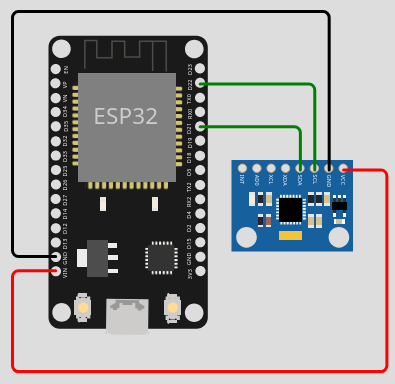
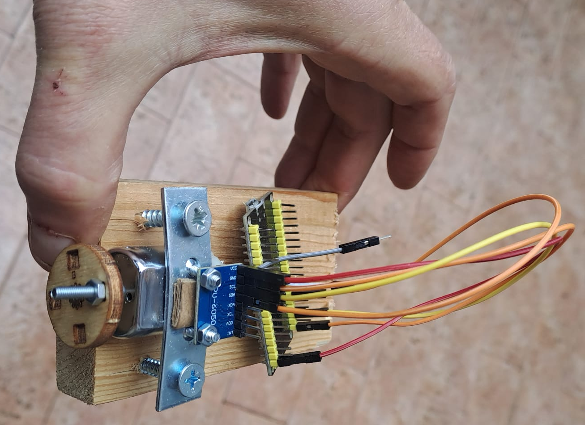
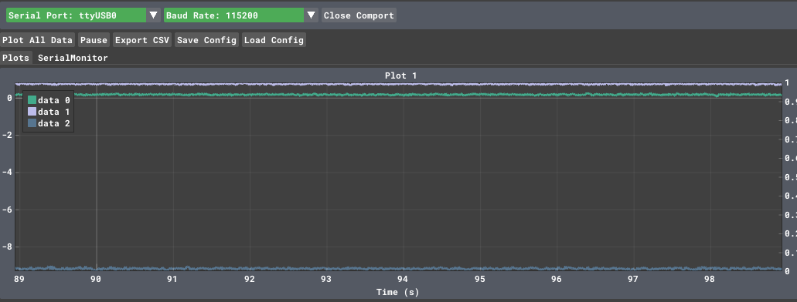
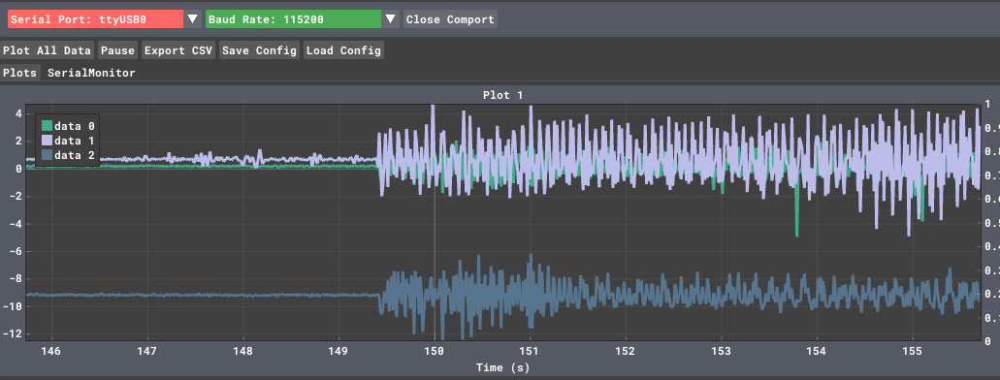
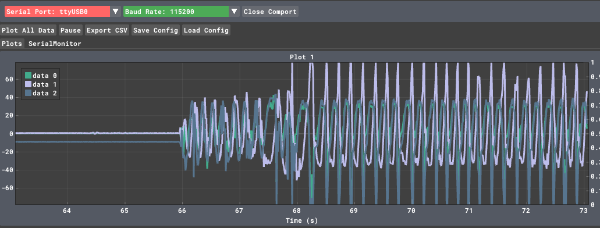
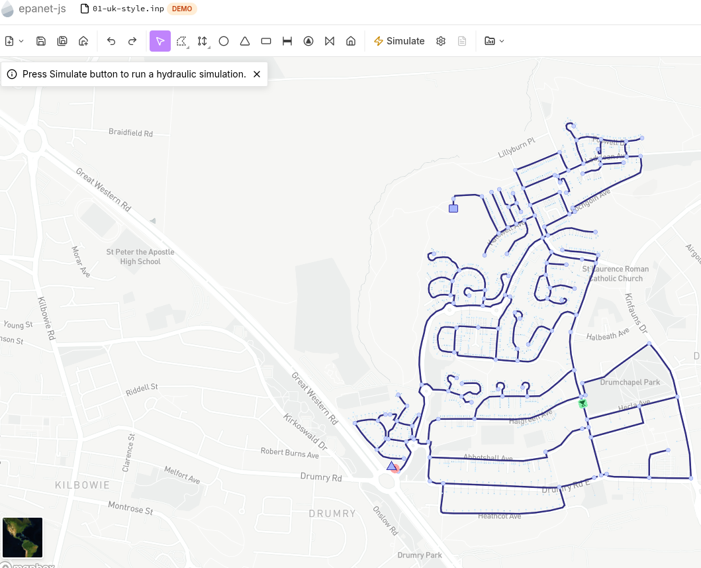

# Digital Twin

A **digital twin** is a virtual representation of a physical system that stays continuously synchronized with it through real-time data, enabling real-time monitoring, predictive simulation, and closed-loop control. In other words, it is a live, data-driven model of a real object, process, or environment. Specifically, sensors on the physical system send continuous data to the digital model, keeping the digital twin up-to-date with what is happening in reality. This data also trains and feeds a model, which is the core component to run simulations to predict performance, failures, and behavior under different conditions. This enables testing different scenarios, including most problematic ones, without putting at risk the real system. The results of the simulations inform decision-makers and guide the actions into the physical system, enabling adaptive control, automated tuning, and optimization of operation. In summary, a typical digital twin forms an iterative loop,  continuously improving with more data, encompassing the following tasks: sense, model, predict, act. This enables faster experimentation rounds (especially when physical tests are slow or expensive), cost reduction, enhanced reliability, intelligent automation, and continuous improvement through data-driven feedback.

The following picture depicts a Digital Twin for a fermentator developed in collaboration with [yeastime](https://yeastime.com/)



## Estimating clock drift 

ESP32 internal oscillators are cost-effective but notoriously sensitive to temperature, leading to a drift that can be several seconds a day.

By building a **Digital Twin**, we aren't just syncing the time; we are creating a mathematical model that lives on your PC, predicts how "wrong" the ESP32 is at any given moment, and feeds back a correction.

### The Architecture

To model the drift, the Twin needs to observe the relationship between the **Physical Clock** (ESP32) and the **Reference Clock** (PC).



We assume the clock drift is linear over short-to-medium durations. The relationship between the ESP32 time ($t_{esp}$) and the PC time ($t_{ref}$) can be modeled as:

$$t_{esp} = (1 + R) \cdot t_{ref} + \phi$$



Where:

- **$R$**: The drift rate (the slope). If $R > 0$, the ESP32 is running fast.
- **$\phi$**: The initial phase offset.

The Digital Twin’s job is to continuously estimate $R$ and $\phi$ using **Linear Regression**.

### Adjustment

Once the Twin calculates the drift rate $R$, it can send a **Correction Factor** back to the ESP32.

Instead of just resetting the time (which causes "time jumps"), the Digital Twin tells the ESP32 how much to "stretch" or "shrink" its perception of a second.

> **The Adjustment Logic:**
> 
> If the Twin calculates that the ESP32 is running **1%** fast, it sends a command: `drift_multiplier = 0.99`. The ESP32 then multiplies its internal delays or timestamps by this factor to stay in sync without jumping.


If you simply did `micros() * multiplier`, the moment your Digital Twin sent a new multiplier (say, from `1.0001` to `0.9999`), your clock would instantly jump backwards by thousands of microseconds.

By using the **Anchor Method** ($base + elapsed \times mult$), we ensure that:

1. **Continuity:** The time at the exact moment of the update remains the same.
2. **Smoothness:** Only the _slope_ of the time progression changes after the update.

###  ESP32 Code (C++)

:fontawesome-brands-github: [https://github.com/andreavitaletti/PlatformIO/tree/main/Projects/Digital_twin](https://github.com/andreavitaletti/PlatformIO/tree/main/Projects/Digital_twin)

We add a `SET_PHASE` command to set the initial "Wall Clock" time.

```c++
#include <Arduino.h>

double drift_multiplier = 1.0;
uint64_t last_raw_micros = 0;
double base_wall_time_s = 0; // The Wall Clock time in seconds (Epoch)

double get_wall_clock() {
    uint64_t current_raw = micros();
    uint64_t elapsed_raw = current_raw - last_raw_micros;
    
    // Convert elapsed microseconds to adjusted seconds
    double elapsed_adjusted_s = (elapsed_raw * drift_multiplier) / 1000000.0;
    return base_wall_time_s + elapsed_adjusted_s;
}

void setup() {
    Serial.begin(115200);
}

void loop() {
    // 1. Send heartbeat to Twin
    static uint32_t last_report = 0;
    if (millis() - last_report > 5000) {
        last_report = millis();
        Serial.print("RAW_MICROS:");
        Serial.print(micros());
        Serial.print(",CUR_WALL:");
        Serial.println(get_wall_clock(), 3); // Tell the twin what we THINK the time is
    }

    // 2. Handle Commands
    if (Serial.available() > 0) {
        String data = Serial.readStringUntil('\n');
        
        // Set the "Starting Line" (Phase)
        if (data.startsWith("SET_PHASE:")) {
            base_wall_time_s = data.substring(10).toDouble();
            last_raw_micros = micros();
            Serial.println("ACK: Phase (Wall Clock) Initialized.");
        }
        
        // Adjust the "Speed" (Frequency)
        if (data.startsWith("SET_MULT:")) {
            // Anchor the time before changing the rate
            base_wall_time_s = get_wall_clock();
            last_raw_micros = micros();
            drift_multiplier = data.substring(9).toDouble();
            Serial.println("ACK: Rate Adjusted.");
        }
    }
}
```

---

### Digital Twin (Python)

The Python script now performs two steps:

1. **Sync Phase:** Sends the current PC time immediately upon connection.
2. **Sync Frequency:** Continues to calculate and send the drift multiplier.

Python - only relevant parts, full code available at  :fontawesome-brands-github: [https://github.com/andreavitaletti/PlatformIO/tree/main/Projects/Digital_twin](https://github.com/andreavitaletti/PlatformIO/tree/main/Projects/Digital_twin)

```python
import serial
import time
from sklearn.linear_model import LinearRegression

class ClockDigitalTwin:
    def add_sample(self, esp_micros):
        # Record the "Gold Standard" time from the PC
        now_pc = time.time()
        
        self.esp_raw_micros.append([esp_micros])
        self.pc_ref_seconds.append(now_pc)
        
        # Keep only the most recent samples to adapt to temperature changes
        if len(self.esp_raw_micros) > WINDOW_SIZE:
            self.esp_raw_micros.pop(0)
            self.pc_ref_seconds.pop(0)
    def calculate_multiplier(self):
        if len(self.esp_raw_micros) < 5:
            return None # Not enough data yet
        
        # Fit model: PC_Time = (m * ESP_Micros) + c
        self.model.fit(self.esp_raw_micros, self.pc_ref_seconds)
        
        # The slope 'm' tells us how many PC seconds pass per 1 ESP32 microsecond
        # We multiply by 1,000,000 because the ESP32 works in microseconds
        multiplier = self.model.coef_[0] * 1_000_000
        return multiplier

with serial.Serial(...) as ser:
            time.sleep(2) # Wait for ESP32 reboot
            ser.reset_input_buffer() # Clear old data
            
            while True:
                # 1. INITIAL PHASE SYNC
                if not phase_synced:
                    now = time.time()
                    ser.write(f"SET_PHASE:{now:.3f}\n".encode())
                    phase_synced = True

                line = ser.readline().decode('utf-8', errors='ignore').strip()
                if not line:
                    continue

                if "ACK" in line:
                    print(f"ESP32: {line}")
                    
                if "RAW_MICROS" in line:
                    try:
                        # Parse: RAW_MICROS:12345,CUR_WALL:17000.123
                        parts = line.split(",")
                        raw_micros = int(parts[0].split(":")[1])
                        esp_thinks_wall = float(parts[1].split(":")[1])
                        
                        twin.add_sample(raw_micros)
                        
                        # 2. FREQUENCY ADJUSTMENT
                        mult = twin.calculate_multiplier()
                        if mult:
                            ser.write(f"SET_MULT:{mult:.8f}\n".encode())
                            error = time.time() - esp_thinks_wall
                            print(f"[PC] Time: {time.time():.3f} | [ESP] Thinks: {esp_thinks_wall:.3f} | Error: {error*1000:.2f}ms | Mult: {mult:.8f}")
```

```
[PC] Time: 1773932593.460 | [ESP] Thinks: 1773932593.483 | Error: -22.51ms | Mult: 0.99999873
ESP32: ACK: Rate Adjusted.
[PC] Time: 1773932598.463 | [ESP] Thinks: 1773932598.484 | Error: -20.65ms | Mult: 0.99999029
```

1. **The Phase Correction (`SET_PHASE`)**: This is like setting a watch. It happens once (or rarely) to align the two clocks to the same "zero" point.
2. **The Frequency Correction (`SET_MULT`)**: This is like adjusting the watch's internal gears. It happens continuously to ensure that as the ESP32 gets hot or cold, the Digital Twin keeps the "Virtual Clock" perfectly aligned with the PC.



!!! note

	20ms is not a true 'clock error,' but simply represents the physical latency required for a log string to travel from the ESP32 at 115200 baud (~3ms), traverse the USB cable, be processed by the PC's operating system drivers, pass through the Python stack, and finally be parsed to trigger `time.time()`. The PC will always capture the `time.time()` stamp with roughly a 20-millisecond delay relative to the exact instant the ESP32 captured the `micros()` value.

!!! warning
    
    Clock drift depends on the temperature 
## Maintenance

* Periodic
* Preventive
* Predictive
* Reactive


### [The difference between Static and Dynamic Unbalance](https://www.youtube.com/watch?v=JB8i7LtY3mU)

<iframe width="560" height="315" src="https://www.youtube.com/embed/JB8i7LtY3mU?si=5j4mh8RmYGS-83ng" title="YouTube video player" frameborder="0" allow="accelerometer; autoplay; clipboard-write; encrypted-media; gyroscope; picture-in-picture; web-share" referrerpolicy="strict-origin-when-cross-origin" allowfullscreen></iframe>

### A simple experiment







[code](https://github.com/andreavitaletti/PlatformIO/tree/main/Projects/Digital_twin)

### A simple model 

Centrifugal force of a mass $m_e$ at distance $r$ from the center of rotation, with angular velocity $\omega$: $F​=m_e ​r \omega$

Using a lumped mass model, and assuming the damping coefficient and the stiffness of the support are negligible, if the mass or the rotor is $m$, we can write :


$m \ddot{x} = m_e ​r \omega^2 cos(\omega t)$

$m \ddot{y} = m_e ​r \omega^2 sin(\omega t)$

This allows us to estimate the accelerations under the simplistic assumptions we made. 

## Water Distribution Systems

[EPANET](https://www.epa.gov/water-research/epanet) is  a software application used throughout the world to model water distribution systems. A convenient way to experiment with EPANET is [epanet-js](https://epanetjs.com/) that claims to be 

> The EPANET you know, but modern, enhanced, and entirely in your browser



### ESP32 as a node in EPANET

We can run epanet-js on nodejs and specifically run a bridge interfacing the EPANET model, in the following '01-uk-style.inp',  with the ESP32 via the serial interface. 

In other words we can use the ESP32 as a sensor of a simulated water distribution network

The bridge code, tunning on node 

```js
const { Project, Workspace } = require('epanet-js');
const { SerialPort } = require('serialport');
const path = require('path');
const fs = require('fs');

// Serial port — adjust to your port (Linux: /dev/ttyACM0, Windows: COM3)
const port = new SerialPort({ path: '/dev/ttyACM0', baudRate: 9600 }, (err) => {
    if (err) console.error('Serial Port Error:', err.message);
});

const inpPath = path.join(__dirname, '01-uk-style.inp');
if (!fs.existsSync(inpPath)) {
    console.error(`ERROR: network.inp not found at ${inpPath}`);
    process.exit(1);
}

const ws = new Workspace();
const model = new Project(ws);

ws.writeFile('net.inp', fs.readFileSync(inpPath));
model.open('net.inp', 'report.rpt', 'out.bin');

// Resolve named IDs to indices once at startup
// Pipe P1 connects J43 → J27
// Junction J1 is the first junction in the network
const idxP1 = model.getLinkIndex('P1');
const idxJ1 = model.getNodeIndex('J1');

console.log(`[EPANET] Network loaded — P1 index: ${idxP1}, J1 index: ${idxJ1}`);

function runSimulation() {
    model.solveH();

    const flow     = model.getLinkValue(idxP1, 8).toFixed(4);  // EN_FLOW (L/s)
    const velocity = model.getLinkValue(idxP1, 9).toFixed(4);  // EN_VELOCITY (m/s)
    const pressure = model.getNodeValue(idxJ1, 11).toFixed(4); // EN_PRESSURE (m)

    const message = `PIPE,P1,${flow},${velocity},${pressure}\n`;
    console.log(`[EPANET] ${message.trim()} -> Sending to Arduino`);

    port.write(message, (err) => {
        if (err) console.error('Write error:', err.message);
    });
}

setInterval(runSimulation, 3000);
```

!!!tip 
    A similar approach can be exploited to interface multiple simulators, however in many case a convenient WASM implementation (i.e. epanet.js), as for EPANET, does not exixt. 
    
    As an example, for traffic simulation you might consider [SUMO](https://eclipse.dev/sumo/). The process is more complex, since you need a local installation, but the approach is the same as the one described above for water.
