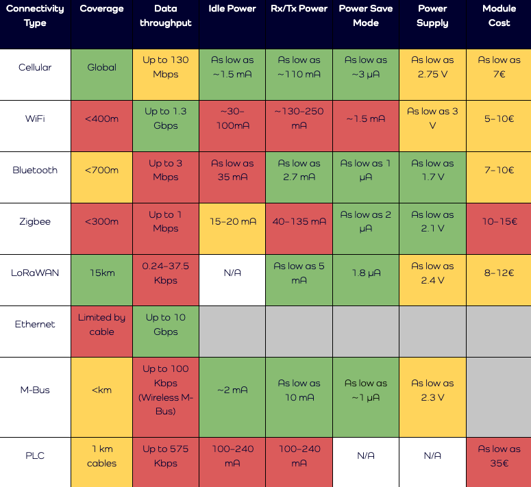
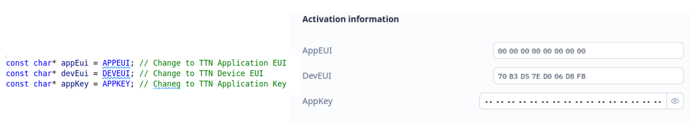

# Wireless Connectivity

For the sake of convenience, we might use WiFi connectivity to illustrate some application scenario. A WiFi Access Point is available everywhere and we can even use our mobile phone in tethering, however:

!!! warning
    WiFi is not appropriate for IoT connectivity since it is power demanding

The selection of the most appropriate wireless connectivity technology depends mostly on the application requirements and it is usually a tradeoff among energy, data throughput, coverage and cost.

The following table compares different wireless technologies and confirms that WiFi has the highest figures in terms of energy consumptions. 

We encourage the use of LoRaWAN. In particular, in our department, we have a Gateway connected to [The Thing Network (TTN)](https://www.thethingsnetwork.org/).

Heltec, produces a nice device relativelt cost-effective, the [WiFi LoRa 32(V3)](https://heltec.org/project/wifi-lora-32-v3/), that we use in our experiments. 

A simple code to establish a first connection si available [here](https://github.com/andreavitaletti/PlatformIO/tree/main/Projects/TTN_connection). 

It is basically the ttn-otaa example available in the [rgot-org/TTN_esp32](https://registry.platformio.org/libraries/rgot-org/TTN_esp32/examples) library.

!!! Note 
    
    Despite the fact that WiFi si not appropriate for many IoT application, it is a convenient technology. While **the use of LORA is strongly encouraged**, the use of WiFi is acceptable provided that 1) you employ suitable energy saving policies, 2) you assume a reasonable **scale down** factor from WiFi consumptions to LORA ones, 3) your measurements meet the requirements of the application. 
    
    As an example a possible scale down factor for RX/TX Power, according to the above table, is 50 (from 250mA (Wifi) to 5ma (LORA))  

## Ad-hoc networking

In certain scenarios, Mobile Ad-hoc Networking (MANET) is required, as it enables communication without pre-existing infrastructure by allowing nodes to act as relays for one another. See the reference architecture [here](intro.md)

### ESP-NOW (ESP32 Proprietary, Peer-to-Peer Mesh)

https://github.com/espressif/esp-now/tree/master

A low-latency, connectionless, peer-to-peer protocol developed by Espressif. It allows multiple ESP32 devices to communicate directly without Wi-Fi infrastructure. Supports broadcast and unicast messages.
    
- **Features:**
    - Low-power, fast transmission.
    - Multi-hop is possible with custom routing logic.
    - Can coexist with Wi-Fi AP/STA modes.

- **Arduino Implementation:**
    - `esp_now.h` library included in Arduino-ESP32 framework.
    - Simple example for sending sensor data across nodes: each node knows neighbors and relays messages.

**Pros:** Very fast, low-power, native to ESP32.  
**Cons:** Multi-hop requires you to implement your own routing; no automatic self-organization.

### painlessMesh

https://gitlab.com/painlessMesh/painlessMesh

An open-source **mesh networking library** for ESP8266/ESP32 using Arduino framework. Implements **self-organizing, multi-hop mesh** out-of-the-box.
    
- **Features:**
    - Each node discovers neighbors automatically.
    - Multi-hop routing included.
    - Messages propagate reliably across mesh.
    - Supports dynamic nodes joining/leaving.
    
- **Arduino Implementation:**
    - Install the `painlessMesh` library from Arduino Library Manager.
    - Example usage: `mesh.sendBroadcast("Hello World");`

**Pros:** Full multi-hop, self-healing mesh, easy to integrate.  
**Cons:** Limited to local area (Wi-Fi range ~100–200 m per hop), message size constraints (~1000 bytes).

---

### ESP-MESH (Espressif Official Wi-Fi Mesh)

Espressif’s **official Wi-Fi mesh protocol**. Fully multi-hop and self-organizing. Designed for **large-scale ESP32 networks**.
    
- **Features:**
    - Dynamic routing and node discovery.
    - Supports up to hundreds of nodes.
    - Compatible with standard Wi-Fi devices at the root (bridge to AP).
    
- **Arduino Implementation:**
    
    - ESP-IDF has full support; Arduino-ESP32 includes `esp_mesh.h` examples.
    - Example: `mesh.init()` initializes the mesh, nodes auto-connect.

**Pros:** Scales well, official support, self-healing.  
**Cons:** Slightly higher memory footprint, more complex API than painlessMesh.

---

### Custom Multi-Hop Protocols Using Wi-Fi Ad-Hoc Mode

ESP32 supports **Wi-Fi Station + Soft-AP mode**, which allows you to implement **ad-hoc networks manually**. Each node can act as a relay.
    
- **Implementation Ideas:**
    
    - Each node maintains a neighbor table.
    - Implement a simple routing protocol like **flooding**, **AODV**, or **OLSR-lite**.
    - Use Arduino Wi-Fi libraries (`WiFi.h`) for communication.
- **Pros:** Full flexibility; can implement experimental protocols.
- **Cons:** You must implement routing, discovery, retries manually.
    

---

### Comparison Table

|Protocol / Library|Multi-Hop|Self-Organizing|Arduino Support|Ease of Use|Best Use Case|
|---|---|---|---|---|---|
|ESP-NOW|Optional (manual)|No|Yes (`esp_now.h`)|Easy|Low-latency peer-to-peer|
|painlessMesh|Yes|Yes|Yes (Library)|Easy|Small-to-medium mesh networks|
|ESP-MESH|Yes|Yes|Yes (Arduino wrapper)|Medium|Large-scale, self-healing mesh|
|Custom Wi-Fi Ad-hoc|Yes|Yes (if implemented)|Yes|Hard|Research / experimental protocols|

---

!!! Tip
    
    For most IoT PoC on ESP32, **painlessMesh** is the easiest way to experiment with multi-hop, self-organizing networks. ESP-MESH is more production-ready but heavier.
