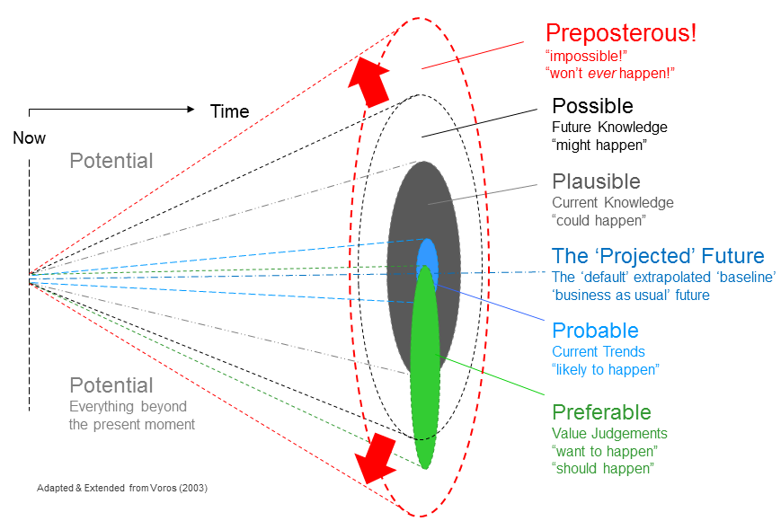
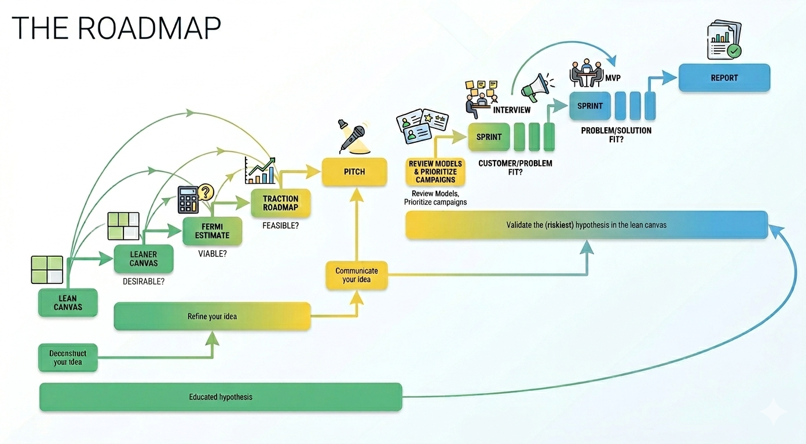

# Learn from the Master(s)

>> *A startup is a temporary organization designed to search for a repeatable and scalable business model.* [Steve Blank](https://steveblank.com/)

## Premise

[source](https://thevoroscope.com/2017/02/24/the-futures-cone-use-and-history/)

 

Here a selection of posts from [Ash Maurya](https://www.linkedin.com/in/ashmaurya/) on Linkedin. It’s a convenient and quick way to share some important insights.

1. However, his LinkedIn profile contains many other valuable messages; I strongly encourage you to explore it further;
2. Teaching startups has little value if you don’t continuously challenge yourself and experiment in practice.

<iframe src="https://www.linkedin.com/embed/feed/update/urn:li:share:7434974618685321216?collapsed=1" height="540" width="504" frameborder="0" allowfullscreen="" title="Embedded post"></iframe>

<iframe src="https://www.linkedin.com/embed/feed/update/urn:li:share:7428805981452570624?collapsed=1" height="540" width="504" frameborder="0" allowfullscreen="" title="Embedded post"></iframe>

<iframe src="https://www.linkedin.com/embed/feed/update/urn:li:share:7427734222452445184?collapsed=1" height="540" width="504" frameborder="0" allowfullscreen="" title="Embedded post"></iframe>

<iframe src="https://www.linkedin.com/embed/feed/update/urn:li:share:7413787999634698240?collapsed=1" height="507" width="504" frameborder="0" allowfullscreen="" title="Embedded post"></iframe>
<iframe src="https://www.linkedin.com/embed/feed/update/urn:li:share:7409705290893496320?collapsed=1" height="669" width="504" frameborder="0" allowfullscreen="" title="Embedded post"></iframe>

<iframe src="https://www.linkedin.com/embed/feed/update/urn:li:share:7422306150710276097?collapsed=1" height="540" width="504" frameborder="0" allowfullscreen="" title="Embedded post"></iframe>
<iframe src="https://www.linkedin.com/embed/feed/update/urn:li:share:7421561686815567891?collapsed=1" height="670" width="504" frameborder="0" allowfullscreen="" title="Embedded post"></iframe>
<iframe src="https://www.linkedin.com/embed/feed/update/urn:li:share:7420852018610769920?collapsed=1" height="670" width="504" frameborder="0" allowfullscreen="" title="Embedded post"></iframe>
<iframe src="https://www.linkedin.com/embed/feed/update/urn:li:share:7416591309127352320?collapsed=1" height="670" width="504" frameborder="0" allowfullscreen="" title="Embedded post"></iframe>

<iframe src="https://www.linkedin.com/embed/feed/update/urn:li:share:7415500493143347200?collapsed=1" height="670" width="504" frameborder="0" allowfullscreen="" title="Embedded post"></iframe>
<iframe src="https://www.linkedin.com/embed/feed/update/urn:li:share:7415394762188345344?collapsed=1" height="670" width="504" frameborder="0" allowfullscreen="" title="Embedded post"></iframe>
<iframe src="https://www.linkedin.com/embed/feed/update/urn:li:share:7410711836116987905?collapsed=1" height="649" width="504" frameborder="0" allowfullscreen="" title="Embedded post"></iframe>

