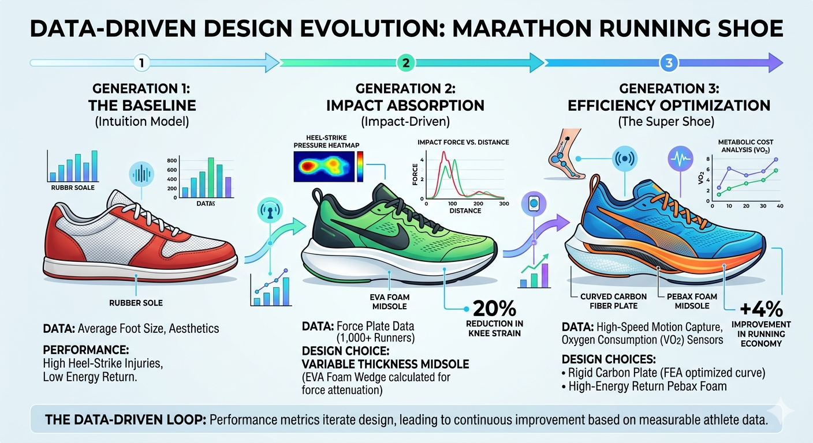

# Data-Driven vs. Data-Informed Design

Data is nowadays the universal currency. This is true also for design, however, how designers choose to spend that currency defines the final product. The terms **data-driven** and **data-informed** are often used interchangeably, but they represent fundamentally different philosophical approaches to innovation.

This distinction determines whether data is the _master_ of the design process, or a highly valued _consultant_.
### Defining the Approaches

- **Data-Driven Design:** The data **dictates** the decision. This is an objective, often algorithmic approach where specific, high-confidence data points automate or directly generate the design outcome. (e.g., "If $X$ increases by $10\%$, then design must change by $Y\%$.")
- **Data-Informed Design:** Data is an **input**, not the answer. This is a holistic approach that interprets data alongside other critical, often subjective factors: human intuition, empathy, context, user feedback, and brand identity. Data _informs_ the designer's judgment, but the final decision rests on human understanding.
### The Evolution of a Running Shoe: From Intuition to Algorithm

To illustrate these concepts, we can simulate the evolution of a professional marathon running shoe. A shoe is a good candidate for this comparison because its function is strictly measurable by performance data (seconds, energy cost), yet its adoption depends entirely on subjective experience (comfort, perception).

This journey, visualized below, moves from a simple starting point (intuition), through an impactful (but blunt) use of data, to the highly sophisticated engineering loop that drives a "Super Shoe."

#### Stage 1: The Intuitive Baseline

We begin with a traditional shoe: **"Generation 1: The Baseline (Intuition Model)."**

Here, data is almost entirely absent. The design is based on **intuition** and basic, static data, such as average foot size (anthropometrics). This model represents the "way we've always done it."

**The Consequence:** While simple and functional, this shoe fails to address dynamic forces. A force plate study of a runner in this shoe would show high, unmanaged peaks of impact force at the heel (the red spike in an imaginary graph). It is intuitive for basic walking, but not mathematically optimized for running 26.2 miles.

---

#### Stage 2: Data-Driven Impact Management

In **"Generation 2: Impact-Driven,"** the design moves to a true data-driven loop.

**The Data Input:** The design team acquires dynamic **Force Plate data** from thousands of runners. This objective data reveals the precise magnitude and location of impact during a full marathon gait cycle.

**The Data-Driven Choice:** The data mandates a change. The designers do not sketch a wedge; an algorithm calculates the exact required volume and taper of **EVA foam midsole** needed to attenuate that specific force and prevent it from "bottoming out" against the asphalt.

**The Clear Outcome:** This objective change yields an objective metric: a measured **20% reduction in knee strain.**

---

#### Stage 3: Data-Informed Efficiency Optimization (The "Super Shoe")

This final stage, **"Generation 3: The Super Shoe,"** is where the concepts of data-driven and data-informed truly diverge.

This shoe must optimize _running economy_ (the metabolic cost of moving), which is a complex function of mechanical advantage (data-driven) and subjective comfort (data-informed).

|**Design Element**|**A Purely DATA-DRIVEN Approach**|**A DATA-INFORMED Approach**|
|---|---|---|
|**Midsole Plate Curve**|The optimal curved shape of the carbon fiber plate is generated via 3D **Finite Element Analysis (FEA)**, simulating maximum energy return at $40\text{mm}$ of midsole thickness.|The plate _is_ included, but its aggressive curvature is modified. Professional athletes test the $40\text{mm}$ version and report feeling "wobbly" or unstable. The designer chooses to use the high-efficiency foam but reduces the midsole height to $38\text{mm}$ to increase **perceived security** and decrease ankle roll risk, accepting a negligible loss in theoretical energy return for a major gain in practical confidence.|
|**Lacing System**|The system is generated by an algorithmic pattern that evenly distributes tensile stress based on pressure maps (objective pressure).|A designer reviews the data but overlays subjective feedback. The algorithm's pattern requires $14$ lace eyelets, which runners find tedious to use and "too fussy" for a high-stress race environment. The system is redesigned to use only $6$ ergonomic eyelets that "feel" more intuitive and secure.|

The "Super Shoe" of Generation 3 is only possible because both disciplines are applied. The carbon plate and Pebax foam are **data-driven** interventions based on VO2 sensors and energy transfer calculations. But their final shape, placement, and ergonomic integration, the elements that make a shoe feel fast, are **data-informed** decisions made by a designer who trusts the numbers, but prioritizes the athlete.

### Approach and proxies

In principle, the data-informed approach permeates every phase of Design Thinking, providing the empirical scaffolding for creative decisions. However, a significant challenge arises: the most critical design 'pinpoints', particularly those involving qualitative human experience, often elude direct sensing.

When sensors cannot capture the nuance of a 'feeling,' the designer’s role shifts. It becomes a fundamental task of the designer to bridge this gap by **designing a proxy**: a method of translating inherently qualitative, subjective experiences into measurable, actionable data points. In this context, the designer doesn't just use data; they design the instruments that bring the 'unmeasurable' into the light.

In the evolution of our **Generation 3 Super Shoe**, a major qualitative hurdle is **Stability**.

**The Qualitative Problem:** Runners report that while the new carbon-plate shoes are fast, they feel "nervous" or "unstable" during sharp turns or on uneven pavement. There is no "Confidence Sensor" to plug into a runner's brain to measure this anxiety.

**The Data-Driven Failure:** A standard sensor might measure **Ankle Pronation Angle**. The data shows the ankle is only moving $2^\circ$ more than usual—statistically negligible. A data-driven approach might ignore the runners' complaints because the "numbers look fine."

**The Designer’s Proxy (The Solution):**

The designer needs a proxy for "Confidence." They decide to measure **"Step Frequency Variability during Directional Change."**

1. **The Logic:** When a human feels stable and confident, their gait is rhythmic and consistent. When they feel "nervous" about their footing, their brain makes micro-adjustments, causing tiny, irregular fluctuations in the timing between steps (cadence jitter).
2. **The Measurement:** By using high-frequency accelerometers, the designer measures the **Standard Deviation of Step Time ($ms$)** during a $90^\circ$ turn.
3. **The Result:** The proxy works. The data shows that in Shoe A, the cadence is erratic during turns, while in Shoe B, it remains steady.

By designing this proxy, the designer has turned a "vague feeling of nervousness" into a hard numerical value that can be used to iterate the design of the shoe's outsole flare or traction pattern.

#### Comparison of Direct vs. Proxy Measurement

| **Qualitative Goal**    | **Direct Sensor (Impossible)** | **Designer’s Proxy (The "Hack")**                                                                                                                                       |
| ----------------------- | ------------------------------ | ----------------------------------------------------------------------------------------------------------------------------------------------------------------------- |
| **User Comfort**        | "Pleasure" probe in the brain. | **Micro-shift Frequency:** Measuring how often a user shifts their weight or adjusts the shoe laces over a $2$-hour period.                                             |
| **Product Premiumness** | "Luxury" meter.                | **Decibel/Frequency Analysis:** The specific "thud" or "click" sound the shoe makes on pavement (Lower frequencies are often perceived as "sturdier" and more premium). |
| **Mental Fatigue**      | Direct neuron monitoring.      | **Pupil Dilation / Eye-Track Jitter:** Measuring how much visual focus is required to maintain balance on a treadmill.                                                  |

---
!!! note "How I wrote this document"

	I sketch the concept roughly, [Gemini](https://gemini.google.com/) (in this case) provides a cleaner version, I review the version and iterate up to a point where I'm satisfied. It is a fair example of a **collaborative, data-informed feedback loop** ;-)