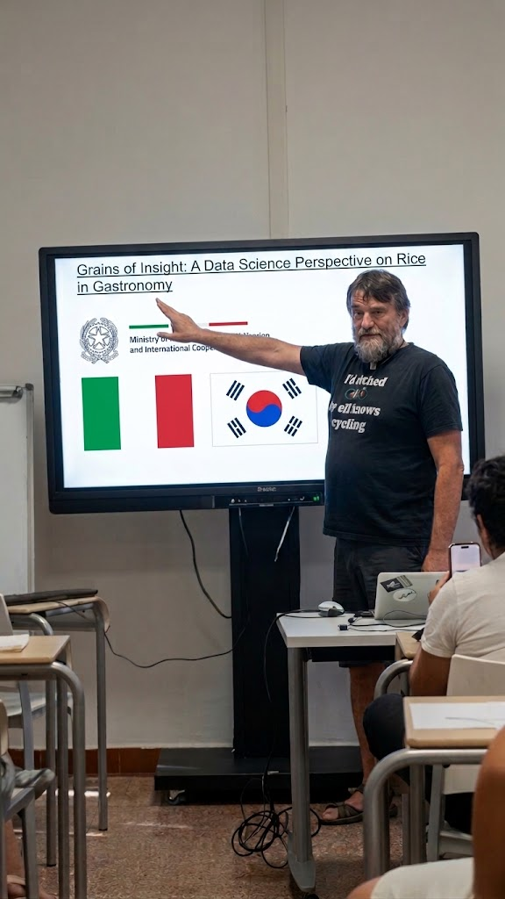

# [Grains of Insight: A Data Science Perspective on Rice in Gastronomy](https://www.esteri.it/wp-content/uploads/2025/11/EP_Italy-Korea_signed.pdf)

Rice is a foundational ingredient in global gastronomy, but its culinary significance varies greatly across cultures. This project, funded by [MAECI](https://www.esteri.it/en/),  explores the
role of rice through a data science lens, with a particular focus on two gastronomically rich contexts: Korea and Italy. While Korea embraces
rice as a daily staple central to dishes like bap, bibimbap, and tteok, Italy incorporates rice in regionally distinctive ways—most notably in
risotto, arancini, and traditional desserts—highlighting its versatility beyond mere sustenance.

By analyzing large-scale datasets from recipe repositories, food blogs, culinary texts, and nutritional sources, the research will uncover how
rice is embedded in the culinary identity of each country. Techniques from natural language processing (NLP), machine learning, and
statistical analysis will be used to map usage patterns, cooking methods, ingredient pairings, and regional trends.

The project will also consider historical, cultural, and socioeconomic factors influencing rice consumption and transformation in both nations.
By contrasting these two case studies, the research will offer insights into how a common ingredient can serve vastly different gastronomic
roles shaped by culture.

The findings will benefit culinary historians, chefs, and food system researchers, while promoting interdisciplinary dialogue between data
science and gastronomy. Ultimately, the project aims to show how rice, though humble in form, carries deep cultural meaning and culinary
innovation.

This project is also a unique opportunity to strengthen the already on-going collaboration between the Korean and Italian research groups
that are currently organizing together the 1st International Workshop on on Computational Gastronomy: Data Science for Food and
Cooking.

## A first attempt of an ontology on rice

<iframe src="https://service.tib.eu/webvowl/#iri=https://gist.githubusercontent.com/andreavitaletti/fcfc9bc2a7ffea9496e184542141202f/raw/666d8fa9357a8c712ef9aec3057c08cfb7341c51/gistfile1.txt" frameborder="0" width="960" height="569" allowfullscreen="true" mozallowfullscreen="true" webkitallowfullscreen="true"></iframe>

* [Visualize the ontology](https://service.tib.eu/webvowl/#iri=https://gist.githubusercontent.com/andreavitaletti/fcfc9bc2a7ffea9496e184542141202f/raw/666d8fa9357a8c712ef9aec3057c08cfb7341c51/gistfile1.txt)
* [The turtle file](https://gist.githubusercontent.com/andreavitaletti/fcfc9bc2a7ffea9496e184542141202f/raw/666d8fa9357a8c712ef9aec3057c08cfb7341c51/gistfile1.txt)

## 4th International Summer School of Scientific and Computational Gastronomy and II International Workshop of Scientific and Computational Gastronomy

We presented our project at the [4th International Summer School of Scientific and Computational Gastronomy](https://www.futurecookinglab.it/?page_id=1721&lang=en) and at the [II International Workshop of Scientific and Computational Gastronomy](https://scientificgastronomy.org/education/workshops/workshop-2026/)

## References

* [An article on the Indian Express](https://indianexpress.com/article/long-reads/how-ai-data-computational-gastronomy-redefining-flavour-pairings-10863553/)
* [A Zotero library on Computational Gastronomy and rice specifically](https://www.zotero.org/groups/6504580/computational_gastronomy/library)
