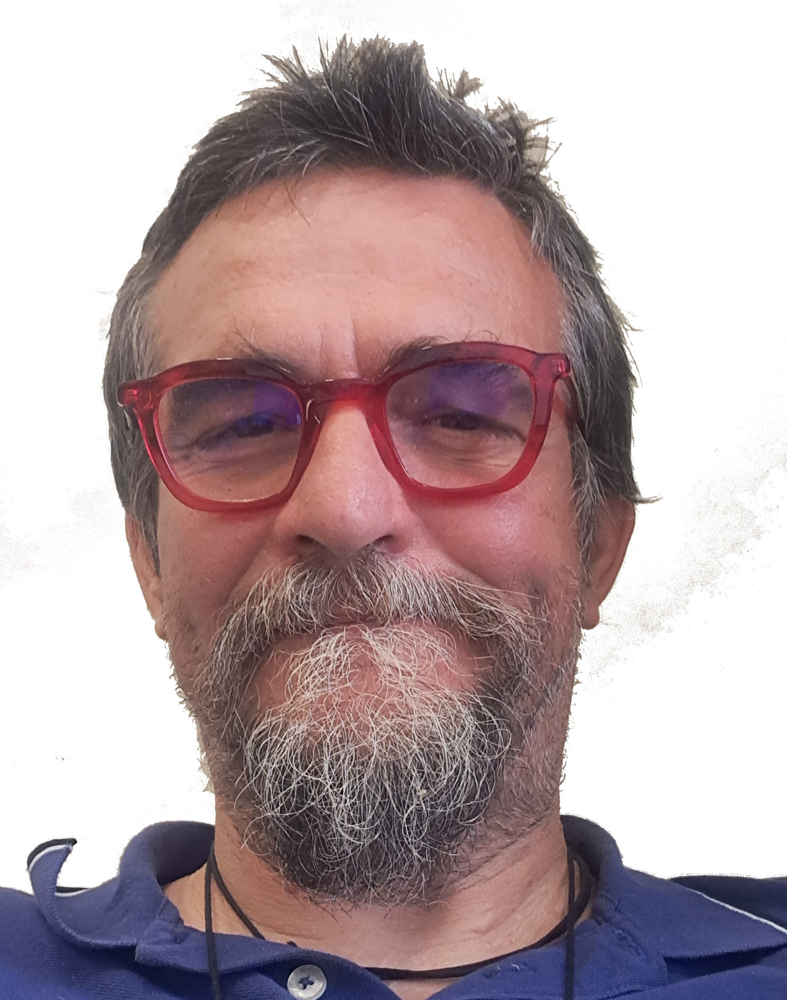
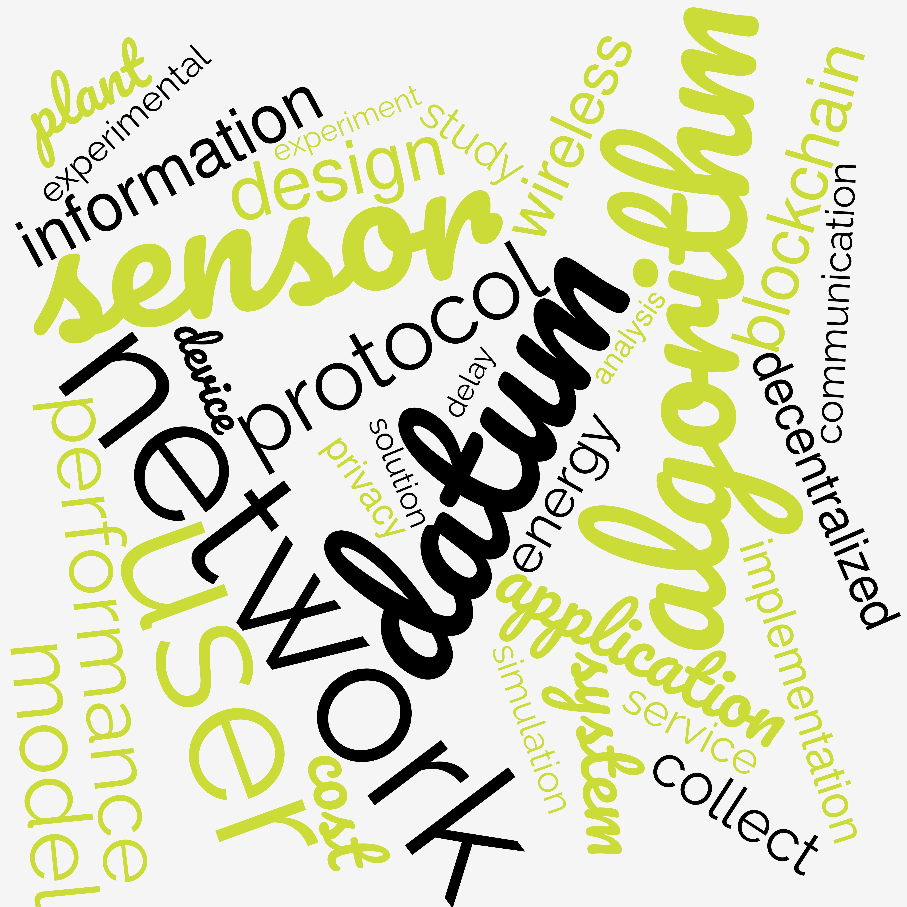
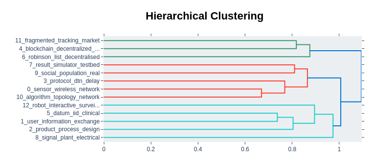

# Andrea Vitaletti

<!-- https://andreavitaletti.github.io/ -->
<!--
|     |                          |
| ----------- | ------------------------------------ |
|       | Andrea Vitaletti Ph.D. in Computer Science. I am currently Associate professor @ Sapienza University of Rome. My research interests include: algorithms and protocols for wireless networks, IoT, private and distributed data management and Distributed Ledger Technologies. I co-authored more than 60 papers I have been involved in a number of EU projects as researcher, principal investigator and coordinator of the FET Open PLEASED. I am a maker and I have some successful experience in transfer of technology: I founded the spin-offs WLAB - sold in 2016 - and WSENSE - left in 2019. I teach networking, data-management and IoT topics at engineering and product design MsC and BsC @ Sapienza. Hobbies: sailing, cycling and paragliding … I play the piano and the guitar for fun… be aware!  |

-->

Andrea Vitaletti Ph.D. in Computer Science. I am currently Associate professor @ Sapienza University of Rome. My research interests include: algorithms and protocols for wireless networks, IoT, private and distributed data management and Distributed Ledger Technologies. I co-authored more than 60 papers I have been involved in a number of EU projects as researcher, principal investigator and coordinator of the FET Open PLEASED. I am a maker and I have some successful experience in transfer of technology: I founded the spin-offs WLAB - sold in 2016 - and WSENSE - left in 2019. I teach networking, data-management and IoT topics at engineering and product design MsC and BsC @ Sapienza.
Hobbies: sailing, cycling and paragliding … I play the piano and the guitar for fun… be aware!

## Education

| From      | To        |                       |
| --------- | --------- |---------------------- |
| Nov. 1998 | Jan. 2002 |PhD in Engineering in Computer Science (Dottorato di Ricerca in Ingegneria Informatica), University of Rome “La Sapienza” |
| Oct. 1992 | Feb. 1998 | MSc in Engineering in Computer Science (Laurea in Ingegneria Informatica), University of Rome “La Sapienza” |

## Work Experience

| From      | To        |                       |
| --------- | --------- |---------------------- |
| Dec. 2019 | Present |Associate Professor at University of Rome “La Sapienza”  |
| Nov. 2007 | Nov. 2019 | Assistant Professor (Ricercatore) University of Rome “La Sapienza”|
| Jul. 2007 | Jun. 2019 | Co-founder and CTO of [WSENSE](http://www.wsense.it)|
| Jul. 2002 | Jun. 2016 | Co-founder and CTO of WLAB (acquired together with Nexse by Alten )|
| Mar. 2002 | Oct. 2007 | Post-doc and research grant at University of Rome “La Sapienza”|
| Mar. 1998 | Oct. 2007 | Senior researcher at ETNOTEAM Research Labs (now NTT DATA) |
| Mar. 2006 | May. 2006 | Visiting researcher at Swiss Federal Institute of Technology in Zurich (ETHZ), Zurich (Switzerland) |
| Apr. 2001 | Ago. 2001 | Consultant at AT&T Labs Research, Florham Park, NJ (USA) |

## Teaching

He teaches networking topics at Sapienza since 2008 in the Master and Bachelor in Computer Engineering (LM-32 and L-8). He is currently teaching   Internet of Things Application and Services (LM-32) and Advanced Information Security Systems and Blockchain for the Master in Cybersecurity (LM-66). Since 2000 he has been teaching a course on Digital Entrepreneurship; this is one among the very few joint courses organized between roman universities (Roma Tre and Sapienza, in particular). This course enjoys a strict collaboration with [DOCK](https://www.dock3.it/en/home-en/) and some of the students attending the course have been awarded on the final DOCK context over the years (e.g. [YEASTIME](https://www.yeastime.com/) and [IOTILZE.ME](https://iotilize.me/)) and are now startup.

From  2018 to 2023 he  gave a course on the Internet of Thing to the Master in Product Design at Sapienza (LM-12). 

Andrea Vitaletti is instructor in the MOOC of Sapienza on Coursera entitled [“Recovering the Humankind’s Past and Saving the Universal Heritage”](https://www.coursera.org/learn/preserving-cultural-heritage).

25-29 September 2023. Data Science PhD course: Crypto and Incentive-based Mechanisms for Blockchain Technology. Togheter with Vangelis Markakis (University of Athens), Ivan Visconti (University of Salerno) and Philip Lazos (Input Output IOG, United Kingdom).

[A Short Course on IoT ](https://andreavitaletti.github.io/IoT_short_course/) taught at the [University of Stellenbosch](https://www.sun.ac.za/english) (South Africa) the 19th and 21st July 2023 during an [Erasmus+](https://erasmus-plus.ec.europa.eu/resources-and-tools/mobility-and-learning-agreements/mobility-agreements) staff mobility for teaching visit. About 40 participants selected among more the 100 candidates. The same course will be replicated in November 2024 at the [Business and Technology University](https://btu.edu.ge/en/home-english/) in Georgia

In 2023 Instructor, togheter with prof. Paolo Merialdo of “L’imprenditoria digitale per la scuola” (Digital Entrepreneurship for the school) by [Fondazinoe i Lincei per la Scuola](https://www.linceiscuola.it/fondazione-lincei-scuola/)

## Transfer of Technology

| From                              | To    |                                                                                                                                                                                                                                                                                                                                                                                                                                                                                                                                                            |
|-----------------------------------|-------|------------------------------------------------------------------------------------------------------------------------------------------------------------------------------------------------------------------------------------------------------------------------------------------------------------------------------------------------------------------------------------------------------------------------------------------------------------------------------------------------------------------------------------------------------------|
| 2002                              | 2016  | In 2002 I founded WLAB, a dynamic SME created to support applied research and prototyping in the area of wireless technologies and pervasive and mobile computing. WLAB has been characterized by the synergy with the universities of Rome (Sapienza and Tor Vergata) promoting a continuous and effective technological transfer of innovative solutions from academia to the industry. I was Chief Technology Officer (CTO) of WLAB until its sale in 2016                                                                                              |
| 2012                              | 2019  | In 2012 I founded WSENSE a spin-off of Sapienza University of Rome, with a strong and experienced R&amp;D team specialized in monitoring and communication systems with pioneering patented solutions in the Internet of Underwater Things (IoUT). I was the CTO of WSENSE and I lead the activities for the development of the WGATE, the cloud platform for the collection, analysis, visualisation and integration of IoT data. WSENSE is an international company, with WSENSE Ltd hosted in the Marine Robotics Innovation Centre of Southampton U.K. |
| 2014                              | 2020   | Among the organizers of the Google Technologies Workshop for Cloud and Web Development now in its fifth edition. The workshop is aimed at students to develop the skills leading them to the realization of a start-up. The success of the workshop is also measured by the fact that some participants are now hosted in business accelerators                                                                                                                                                                                                            |
|in 2014                      |       | Successful experience in a crowd-funding campaign with the project COVA that has been also boradcasted in the Italian main TV channel RAI                                                                                                                                                                                                                                                                                                                                                                                                                  |
| in 2014                      |       | The WSN group @ DIAG I lead designed and developed the MagoNode: a new wireless device for WSN networks operating in the 2.4Ghz ISM band deployed in many field trials.                                                                                                                                                                                                                                                                                                                                                                                    |
| in 2001  |       | During my stay at AT&amp;T Research Labs of Florham Park, NJ - USA, my research activity led to the application of four provisional patent applications.                                                                                                                                                                                                                                                                                                                                                                                                  |
| 2019                              | today | Member of the ADI committee in the reserch for business category  |

## Patents

* Patent 102003901105392 (RM2003A000177): Procedure for the recognition of authenticity of documents and debt securities, in particular banknotes, and related system.

* Patent 102001900950099 (RM2001A000492): Method for the secure transmission of data through short message service messages (SMS) with related methods for generating and recognizing secure SMS

## Projects

I have acquired a significant experience on research projects, gained in more than 15 years of participation to academic and industrial projects characterized in many cases by a marked multidisciplinarity approach. Over the time I assumed various roles, with different responsibilities, as researcher, principal investigator (PI) and finally coordinator.

**On going projects**

* Made in Italy Circolare e Sostenibile ([MICS](https://www.mics.tech/en/home/)) National Plan for Recovery and Resilience NextGenerationEU ([PNRR](https://www.agenziacoesione.gov.it/dossier_tematici/nextgenerationeu-e-pnrr/)) program, [SPOKE 8](https://www.mics.tech/en/spokes/spoke-8/) Digitally-oriented factory design and management through AI and data driven approaches,  [Project 8.06](https://www.mics.tech/en/projects/8-06-blockchain-based-solutions-for-trusted-and-quality-aware-data-sharing/) Blockchain-based solutions for trusted and quality-aware data sharing

*  SEcurity and RIghts in the CyberSpace [SERICS](https://serics.eu/en/) National Plan for Recovery and Resilience NextGenerationEU ([PNRR](https://www.agenziacoesione.gov.it/dossier_tematici/nextgenerationeu-e-pnrr/)), [SPOKE 9]([Securing Digital Transformation](https://serics.eu/en/services/spoke-9-sicurezza-trasformazione-digitale/)) Securing Digital Transformation,  Project Smart Decentralized Finance (SmartDeFi)

* ERASMUS-EDU-2022-CBHE project titled “Smart City ASEAN Learning Network (SCALe)” with project number: [101083278](https://erasmus-plus.ec.europa.eu/projects/search/details/101083278) 

**Past Projects**

*   MISE (Ministry of Economic Development) Project. [Copyright management on 5G network over Blockchain](https://www.mise.gov.it/images/stories/documenti/Sintesi-proposte-progettuali-vincitrici-TE20.pdf). The project is managed by [SIAE](https://www.siae.it/en), the Italian Collective Management Organization. I lead the activity of WP2 focused on the open research issues to implement a copyright management on blockchain
    
*   [Decentralised RObinson List](https://youtu.be/9ENPsHyAcXU). The project is managed by [Fondazione Ugo Bordoni](https://www.fub.it/en). This project won the [Algorand Grand Prize](https://www.algorand.com/resources/blog/recap-future-of-blockchain-competition) at [Future of Blockchain](https://medium.com/future-of-blockchain-competition/future-of-blockchain-2-summary-and-prizes-e87f3c6f392f) Competition.
    
*   MISE (Ministry of Economic Development) Project. [Smart Factory, Agrifood and Life Science.](https://www.mise.gov.it/index.php/it/incentivi/impresa/bando-fabbrica-intelligente-agrifood-e-scienze-vita) MaaS (Maintenance as a Service) platform based on the integrated use of IoT-Blockchain, for the inter-operational and transparent sharing of authenticated and protected information, regarding the enhancement and operational management in REAL time of technical ASSETS and economic transactions related to the interactions between the various parties involved in the entire Facility Management chain
    
*   Sapienza Project on Blockchain and Public Administration.
    
*   [Erasmus+ Capacity Building in Higher Education: Master Degree in Industry 4.0](https://eacea.ec.europa.eu/sites/eacea-site/files/cbhe_2019_-_results_for_website.pdf) Project No. 610455-EPP-1-2019-1-MY-EPPKA2-CBHE-JP
    

*   FP7-PEOPLE-ITN-2008 [FRONTS (PI)](https://cordis.europa.eu/project/rcn/85404_en.html), Overall Budget: EUR 3.1 Mln. From 01-02-2008 to 30-04-2011. The aim of this project is to establish the foundations of adaptive networked societies of tiny heterogeneous artifacts. I participated to all the review meetings where I presented the activities of WP2.
    
*   FP7-ICT-2009-5 [VITRO (PI)](http://cordis.europa.eu/project/rcn/95468_en.html), Overall Budget: EUR 3.4 Mln. From 01-09-2010 to 28-02-2013. This project is focused on developing architectures, algorithms and engineering methods, to enable the realization of scalable, flexible, adaptive, energy-efficient and trust-aware Virtual Sensor Network platforms. I participated to all the review meetings where I presented the activities of WP3.
    
*   ARTEMISI-JU call 2009, [CHIRON (PI)](https://artemis-ia.eu/project/17-chiron.html), Overall Budget: EUR 17.8 Mln. From 01-03-2010 to 01-02-2013. CHIRON combines state-of-the-art technologies and innovative solutions into an integrated framework for effective and person-centric health management throughout the complete (health)care cycle.
    
*   EU EUROSTARS-EUREKA, [PharmAID (PI)](https://www.eurostars-eureka.eu/project/id/5067), Overall Budget: EUR 2 Mln. From 01-06-2010 to 31-12-2012. The mainpurpos of the project is the development of an solution for the pharmaceutical market based on passive RFID tags capabe to: a) prevent drugs’ counterfeiting; b) certify drugs’ integrity; and c) track drugs along the whole supply chain. I participated to all the review meetings where I presented the activities of WP5.
    
*   FP7-ICT-2011-C FET (Future Emerging Technology) OPEN, [PLEASED](https://cordis.europa.eu/project/rcn/103686_en.html) (**Coordinator**), Overall Budget: EUR 1.46 Mln. From 01-05-2012 to 30-04-2015. Evaluated Excellent. In this project we develop a technology capable to interface and understand electrical signals gereated by plants in reaction to external stimuli. This is teh premise of the development of plant cyborgs. While artificial sensing devices exist that can monitor environmental parameters of interest, such as temperature or humidity, the focus of our research is the use of plants themselves as sensing and decision-making devices. The results of the multidisciplinary team in the project have obtained a significant eco in he media such as [Youtube](https://youtu.be/2tgdCB3v7mE%20http://bbc.in/1ow6KSJ) and [Wired](https://www.wired.com/2014/01/internet-plants/).
    
*   EU FI-ADOPT, [PAGE](https://www.f6s.com/fiware-fiadopt) (**Coordinator**), Overall Budget: EUR 150 K. From 01-11-2014 to 01-11-2015. Evaluated Excellent. A project to develop a technology capable to effectively support elderly in their daily activities.
    
*   FP7-ICT-2013-10. [SUNRISE](https://cordis.europa.eu/project/rcn/110326_en.html) (I). Overall Budget: EUR 5.3 Mln. From 2013-09-01 to 2016-12-31. The SUNRISE main objective is the development of a federated underwater communication network, based on pilot infrastructures already designed, built and deployed by consortium partners, in diverse environments, web-accessible and interfaced with existing FIRE facilities to experiment with Future Internet technologies.
    
*   EASME [ARCHEOSUb](http://www.archeosub.eu/index.php/en/) (I) . The ARCHEOSUb (Autonomous underwater Robotic and sensing systems for Cultural Heritage discovery Conservation and in situ valorization) project aims at developing products and services to support the discovery, monitoring and protection of Underwater Cultural Heritage (UCH) sites.
    
**Other earlier project activities**

*   I was the technical manager of the DIAG group in Rome “La Sapienza” for the project VICOM (Virtual Immersive COMmunications - http://www.vicom-project.it/). The project has developed the infrastructure for the provisioning of augmented realty mobile services. In particular, the group of Rome has developed the framework for the location of mobile users through heterogeneous technologies (GPS, CellID, WiFi, Sensor Networks …)
    
*   I was the coordinator and technical manager of the CINI lab in Rome. The lab participated in the FIRB project WEB, developing a framework for the remote access to multimedia context sensitive services (eg: tourist guides on mobile phones where the information is georeferenced).
    
*   I collaborated with the group of Professor Chiara Petrioli within the European project EYES (Energy Efficient Sensor networks - http://www.eyes.eu.org/) for the creation of energy-efficient self-organizing sensor networks.
    
*   I collaborated with the group of Professor Chiara Petrioli in the EU project WiSeNts (Wireless Sensor Networks and Cooperating Smart Objects). The project studied the main dynamics for the realization of complex systems of intelligent and cooperating objects (e.g. sensor networks). As part of this project I visited the Swiss Federal Institute of Technology in Zurich (ETHZ) in 2006.
    
*   I was a researcher in the European project AEOLUS (Algorithmic Principles for Building Efficient Overlay Computers - http://dmod.cs.uoi.gr/aeolus site / main.htm). The project investigated methods and algorithms for creating overlay networks for the efficient and transparent access to Internet resources.
    
*   I was a researcher in the European project DELIS (Dynamically Evolving, Large-scale Information Systems - http://delis.upb.de/). The project has developed methods, techniques and tools to effectively manage modern information systems, characterized by large and extremely dynamic information.
    
*   In the EU SOFIA project (Artemisia - https://www.artemisia-association.org/sofia), I was task leader for TASK3.3 in WP3. The SOFIA project has created a platform for interoperability between embedded systems in smart environments.                                                                                                                                                                             |
## Research

The following figure shows the [Wordcloud](https://www.wordclouds.com/) of the abstracts of my papers downloaded from [Scopus](https://www.scopus.com/authid/detail.uri?authorId=6506463530) and I think well capture the evolution of my research interests.

I initially focused on wireless networks for the collection of data to provide useful services to the users. This activity, is nowadays part of the wider research on the Internet of Things (IoT) and more recently naturally brought me to start an investigation on Decentralized Applications and Blockchain Technologies.

A distinctive characteristics of my research is the attempt to always validate the performance of the proposed solutions, namely algorithms and protocols, both theoretically and practically.

I lead the research activities on wireless sensor networks and the Internet of Things, in the research group on Computer Networks and Pervasive Systems of the Department of Automatic Computer Engineering and Management Antonio Ruberti della Sapienza University of Rome (DIAG). In this context, I enjoied the cooperation with several international research organizations, including: Research Academic Computer Technology Institute (Greece), Braunschweig University of Technology (Germany), Universitat Paderborn (Germany), University of Athens (Greece), Ben-Gurion University of the Negev (Israel), University of Salerno (Italy), Wroclaw University of Technology (Poland), Universitat Politecnica de Catalunya (Spain), University of Geneva (Switzerland), University of Lubeck (Germany).

I founded the laboratory on the wireless sensor network at DIAG where the solutions - both hardware and software - designed in the our research activities, are implemented and tested in the field. In the lab, we developed and implemented the MagoNode: a new wireless device for WSN networks operating in the 2.4Ghz ISM band deployed in many field trials.

I enjoy a long term collaboration on cooperative design and co-design with faculties of the MSc in Product Design at Sapienza. In particular, I’m leading the research activities on the employment of genetic algorithms for product design.

## Publications

Nowadays, the most updated way to access to the list of my publications is on 

* [Scopus](https://www.scopus.com/authid/detail.uri?authorId=6506463530)
* [Google Scholar](https://scholar.google.ca/citations?hl=en&user=tN4xL-IAAAAJ&view_op=list_works&sortby=pubdate)
* [DBLP](https://dblp.org/pid/v/AndreaVitaletti.html)
* [ORCID](https://orcid.org/0000-0003-1074-5068)

I used the technique described [here](https://www.kaggle.com/code/nechbamohammed/abstract-clustering-for-scientific-paper-insights) to  cluster my papers based on their abstracts. The result is shown in the following picture

I think this approach provides good results that well reflects my research over time. Papers are classified according to the opics  as shown in the following picture

The interactive graphs produced by the [Colab notebook](https://colab.research.google.com/drive/1XGpF8d5WoR2sOFMits1Y5TkaImMOstPy?usp=sharing) used to obtain these results is available [here](assets/Abstract_Analysis.html)

<!--
Blah blah [@korteweg_data_2007]... [@amaxilatis_delivering_2017] 
\nocite{*}
\bibliography 
-->
